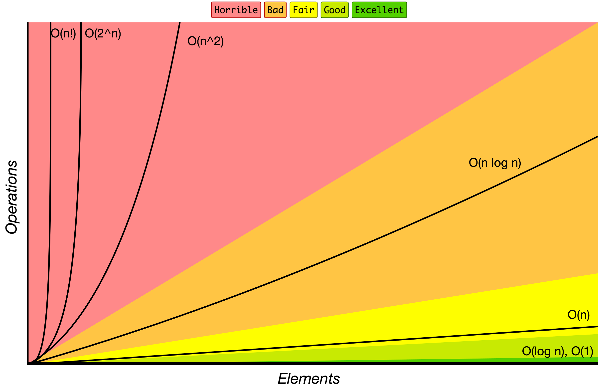

# JavaScript Thuật Toán và Cấu Trúc Dữ Liệu

[](https://github.com/trekhleb/javascript-algorithms/actions?query=workflow%3ACI+branch%3Amaster)
[](https://codecov.io/gh/trekhleb/javascript-algorithms)

Repository này bao gồm nhiều ví dụ thuật toán và cấu trúc dữ liệu phổ biến
dựa trên Javascript.

Mối thuật toán và cấu trúc dữ liệu có README riêng với những lý giải và links
liên quan để đọc thêm (bao gồm cả những videos trên Youtube).

_Đọc bằng ngôn ngữ khác:_
[_English_](README.md),
[_简体中文_](README.zh-CN.md),
[_繁體中文_](README.zh-TW.md),
[_한국어_](README.ko-KR.md),
[_日本語_](README.ja-JP.md),
[_Polski_](README.pl-PL.md),
[_Français_](README.fr-FR.md),
[_Español_](README.es-ES.md),
[_Português_](README.pt-BR.md),
[_Русский_](README.ru-RU.md),
[_Türk_](README.tr-TR.md),
[_Italiana_](README.it-IT.md),
[_Bahasa Indonesia_](README.id-ID.md),
[_Українська_](README.uk-UA.md),
[_Arabic_](README.ar-AR.md)

*☝ Dự án này chỉ được sử dụng cho mục đích học tập và nghiên cứu, **không** được dùng
cho mục đích thương mại.*

## Cấu Trúc Dữ Liệu

Cấu trúc dữ liệu là một cách cụ thể để tổ chức và lưu trữ dữ liệu trong máy tính để nó có thể
được truy cập và sửa đổi một cách hiệu quả. Chính xác hơn, cấu trúc dữ liệu là một tập hợp
các giá trị dữ liệu, các mối quan hệ giữa chúng và các hàm hoặc phép toán có thể được áp dụng
cho dữ liệu.

`B` - Cơ bản, `A` - Nâng cao

* `B` [Danh sách liên kết](src/data-structures/linked-list)
* `B` [Danh sách liên kết đôi](src/data-structures/doubly-linked-list)
* `B` [Hàng đợi](src/data-structures/queue)
* `B` [Ngăn xếp](src/data-structures/stack)
* `B` [Bảng băm](src/data-structures/hash-table)
* `B` [Đống](src/data-structures/heap) - max và min heap
* `B` [Hàng đợi ưu tiên](src/data-structures/priority-queue)
* `A` [Cây tiền tố](src/data-structures/trie)
* `A` [Cây](src/data-structures/tree)
  * `A` [Cây tìm kiếm nhị phân](src/data-structures/tree/binary-search-tree)
  * `A` [Cây AVL](src/data-structures/tree/avl-tree)
  * `A` [Cây đỏ đen](src/data-structures/tree/red-black-tree)
  * `A` [Cây phân đoạn](src/data-structures/tree/segment-tree) - với các ví dụ truy vấn phạm vi nhỏ nhất/lớn nhất/tổng
  * `A` [CÂy Fenwick](src/data-structures/tree/fenwick-tree) (Cây chỉ mục nhị phân)
* `A` [Đồ thị](src/data-structures/graph) (có hướng và vô hướng)
* `A` [Tập hợp không giao nhau](src/data-structures/disjoint-set)
* `A` [Bộ lọc Bloom](src/data-structures/bloom-filter)

## Thuật Toán

Thuật toán là một đặc tả rõ ràng về cách giải quyết một lớp vấn đề. Nó là một tập hợp các
quy tắc xác định chính xác một chuỗi phép toán.

`B` - Cơ bản, `A` - Nâng cao

### Thuật toán theo chủ đề

* **Toán**
  * `B` [Thao tác bit](src/algorithms/math/bits) - đặt/lấy/cập nhật/xóa bit, nhân/chia 2, đổi dấu âm,...
  * `B` [Giai thừa](src/algorithms/math/factorial)
  * `B` [Số Fibonacci](src/algorithms/math/fibonacci) - cổ điển và dạng đóng
  * `B` [Thừa số nguyên tố](src/algorithms/math/prime-factors) - tìm và đếm thừa số nguyên tố sử dụng định luật Hardy-Ramanujan's
  * `B` [Kiểm tra tính nguyên tố](src/algorithms/math/primality-test) (phân chia thử nghiệm)
  * `B` [Thuật toán Euclid](src/algorithms/math/euclidean-algorithm) - tính ước số chung lớn nhất (GCD)
  * `B` [Bội số chung nhỏ nhất](src/algorithms/math/least-common-multiple) (LCM)
  * `B` [Sàng số nguyên tố](src/algorithms/math/sieve-of-eratosthenes) - tìm tất cả các số nguyên tố trong bất kỳ phạm vi nhất định nào
  * `B` [Xác định lũy thừa của 2](src/algorithms/math/is-power-of-two) - kiểm tra xem số có phải là lũy thừa của 2 hay không (thuật toán nguyên bản và theo bit)
  * `B` [Tam giác Pascal](src/algorithms/math/pascal-triangle)
  * `B` [Số phức](src/algorithms/math/complex-number) - số phức và các phép toán cơ bản với số phức
  * `B` [Radian & độ](src/algorithms/math/radian) - chuyển đổi giữa đơn vị radian và độ
  * `B` [Tính nhanh lũy thừa](src/algorithms/math/fast-powering)
  * `B` [Phương pháp Horner's](src/algorithms/math/horner-method) - tính giá trị đa thức
  * `B` [Ma trận](src/algorithms/math/matrix) - ma trận và các phép toán cơ bản (phép nhân, phép chuyển vị,...)
  * `B` [Khoảng cách Euclid](src/algorithms/math/euclidean-distance) - khoảng cách giữa hai điểm/véc-tơ/ma trận
  * `A` [Phân hoạch](src/algorithms/math/integer-partition)
  * `A` [Căn bậc hai](src/algorithms/math/square-root) - phương pháp Newton
  * `A` [Thuật cắt đường tròn - Lưu Huy](src/algorithms/math/liu-hui) - phép tính gần đúng số π dựa vào đa giác
  * `A` [Biến đổi Fourier rời rạc](src/algorithms/math/fourier-transform) - phân giải tín hiệu thời gian thành các tần số tạo nên tín hiệu đó
* **Tập hợp**
  * `B` [Tích Đề-các](src/algorithms/sets/cartesian-product) - tích của nhiều tập hợp
  * `B` [Thuật toán xáo trộn](src/algorithms/sets/fisher-yates) - dãy hữu hạn hoán vị ngẫu nhiên
  * `A` [Tập lũy thừa](src/algorithms/sets/power-set) - tập hợp chứa tất cả các tập con (theo bit và quay lui)
  * `A` [Hoán vị](src/algorithms/sets/permutations) (lặp và không lặp)
  * `A` [Tổ hợp](src/algorithms/sets/combinations) (lặp và không lặp)
  * `A` [Dãy con chung dài nhất](src/algorithms/sets/longest-common-subsequence) (LCS)
  * `A` [Dãy con chung tăng dần dài nhất](src/algorithms/sets/longest-increasing-subsequence)
  * `A` [Dãy con chung ngắn nhất](src/algorithms/sets/shortest-common-supersequence) (SCS)
  * `A` [Bài toán xếp ba lô](src/algorithms/sets/knapsack-problem) - dạng 0-1 và không bị chặn
  * `A` [Mảng con lớn nhất](src/algorithms/sets/maximum-subarray) - phiên bản vét cạn và quy hoạch động (Kadane)
  * `A` [Tổ hợp của tổng](src/algorithms/sets/combination-sum) - tìm tất cả các tổ hợp tạo thành tổng cụ thể 
* **Chuỗi**
  * `B` [Khoảng cách Hamming](src/algorithms/string/hamming-distance) - số các vị trí các ký hiệu khác nhau 
  * `A` [Khoảng cách Levenshtein](src/algorithms/string/levenshtein-distance) - khoảng cách thay đổi nhỏ nhất giữa hai chuỗi ký tự
  * `A` [Thuật toán Knuth–Morris–Pratt](src/algorithms/string/knuth-morris-pratt) (thuật toán KMP) - tìm chuỗi con (đối sánh mẫu) 
  * `A` [Thuật toán Z](src/algorithms/string/z-algorithm) - tìm chuỗi con (đối sánh mẫu)
  * `A` [Thuật toán Rabin Karp](src/algorithms/string/rabin-karp) - tìm chuỗi con
  * `A` [Xâu con chung dài nhất](src/algorithms/string/longest-common-substring)
  * `A` [Phối biểu thức chính quy](src/algorithms/string/regular-expression-matching)
* **Tìm kiếm**
  * `B` [Tìm kiếm tuyến tính](src/algorithms/search/linear-search)
  * `B` [Tìm kiếm nhảy](src/algorithms/search/jump-search) (tìm khối) - tìm kiếm trong mảng đã sắp xếp 
  * `B` [Tìm kiếm nhị phân](src/algorithms/search/binary-search) - tìm kiếm trong mảng đã sắp xếp 
  * `B` [Tìm kiếm nội suy ](src/algorithms/search/interpolation-search) - Tìm kiếm strong mảng có thứ tự được phân phối đồng nhất
* **Sắp xếp**
  * `B` [Sắp xếp nổi bọt](src/algorithms/sorting/bubble-sort)
  * `B` [Sắp xếp chọn](src/algorithms/sorting/selection-sort)
  * `B` [Sắp xếp chèn](src/algorithms/sorting/insertion-sort)
  * `B` [Sắp xếp vun đống](src/algorithms/sorting/heap-sort)
  * `B` [Sắp xếp trộn](src/algorithms/sorting/merge-sort)
  * `B` [Sắp xếp nhanh](src/algorithms/sorting/quick-sort) - Tại chỗ và không tại chỗ
  * `B` [Shellsort](src/algorithms/sorting/shell-sort)
  * `B` [Sắp xếp đếm](src/algorithms/sorting/counting-sort)
  * `B` [Sắp xếp theo cơ số](src/algorithms/sorting/radix-sort)
* **Danh sách liên kết**
  * `B` [Di chuyển chính hướng](src/algorithms/linked-list/traversal)
  * `B` [Di chuyển ngược hướng](src/algorithms/linked-list/reverse-traversal)
* **Cây**
  * `B` [Depth-First Search](src/algorithms/tree/depth-first-search) (DFS)
  * `B` [Breadth-First Search](src/algorithms/tree/breadth-first-search) (BFS)
* **Đồ thị**
  * `B` [Tìm kiếm theo chiều sâu](src/algorithms/graph/depth-first-search) (DFS)
  * `B` [Tìm kiếm theo chiều rộng](src/algorithms/graph/breadth-first-search) (BFS)
  * `B` [Thuật toán Kruskal](src/algorithms/graph/kruskal) - tìm cây bao trùm nhỏ nhất (MST) cho đồ thị vô hướng có trọng số
  * `A` [Thuật toán Dijkstra Algorithm](src/algorithms/graph/dijkstra) - tìm những đường ngắn nhất từ một định tới tất cả các đỉnh
  * `A` [Thuật toán Bellman-Ford](src/algorithms/graph/bellman-ford) - tìm những đường ngắn nhất từ một đỉnh tới tất cả các đỉnh của đồ thị
  * `A` [Thuật toán Floyd-Warshall](src/algorithms/graph/floyd-warshall) - tìm những đường ngắn nhất giữa tất cả các cặp đỉnh
  * `A` [Phát hiện vòng](src/algorithms/graph/detect-cycle) - cho cả đồ thị có hướng và vô hướng (dựa trên DFS và tập không giao)
  * `A` [Thuật toán Prim](src/algorithms/graph/prim) - tìm cây bao trùm nhỏ nhất (MST) cho đồ thị vô hướng có trọng số
  * `A` [Sắp xếp tô pô](src/algorithms/graph/topological-sorting) - phương pháp DFS
  * `A` [Điểm khớp](src/algorithms/graph/articulation-points) - Thuật toán Tarjan (dựa trên DFS)
  * `A` [Cầu nối](src/algorithms/graph/bridges) - dựa trên DFS
  * `A` [Đường đi Euler và Chu trình Euler](src/algorithms/graph/eulerian-path) - thuật toán Fleury - đi qua các cạnh chỉ một lần duy nhất
  * `A` [Chu trình Hamilton](src/algorithms/graph/hamiltonian-cycle) - đi qua các đỉnh chỉ một lần duy nhất
  * `A` [Các thành phần kết nối chặt](src/algorithms/graph/strongly-connected-components) - Thuật toán Kosaraju
  * `A` [Bài toán người bán hàng](src/algorithms/graph/travelling-salesman) - tuyến đường ngắn nhất có thể đến thăm từng thành phố và trở về thành phố gốc
* **Mật mã học**
  * `B` [Băm đa thức](src/algorithms/cryptography/polynomial-hash) - lăn hàm băm dựa trên đa thức 
  * `B` [Mật mã hàng rào đường sắt](src/algorithms/cryptography/rail-fence-cipher) - một thuật toán mật mã chuyển vị để mã hóa thông điệp 
  * `B` [Mật mã Caesar](src/algorithms/cryptography/caesar-cipher) - mật mã chuyển vị đơn giản
  * `B` [Mật mã Hill](src/algorithms/cryptography/hill-cipher) - mật mã chuyển vị đơn giản dựa trên đại số tuyến tính
* **Học máy**
  * `B` [NanoNeuron](https://github.com/trekhleb/nano-neuron) - 7 hàm JS đơn giản minh họa cách máy tính thực sự có thể học (truyền thuận / truyền ngược) 
  * `B` [k-NN](src/algorithms/ml/knn) - thuật toán phân loại k láng giềng gần nhất
  * `B` [k-Means](src/algorithms/ml/k-means) - thuật toán phân cụm k-Means
* **Khác**
  * `B` [Tháp Hà Nội](src/algorithms/uncategorized/hanoi-tower)
  * `B` [Xoay ma trận vuông](src/algorithms/uncategorized/square-matrix-rotation) - thuật toán tại chỗ
  * `B` [Trò chơi nhảy](src/algorithms/uncategorized/jump-game) - ví dụ quay lui, quy hoạch động (từ trên xuống + từ dưới lên), dynamic programming (top-down + bottom-up) và tham lam
  * `B` [Các đường đi đặc trưng duy nhất](src/algorithms/uncategorized/unique-paths) - ví dụ quay lui, quy hoạch động và tam giác Pascal
  * `B` [Thu thập nước mưa](src/algorithms/uncategorized/rain-terraces) - bài toán bẫy nước mưa (phiên bản quy hoạch động và vét cạn)
  * `B` [Cầu thang đệ quy](src/algorithms/uncategorized/recursive-staircase) - đếm số cách lên đến đỉnh (4 lời giải)
  * `B` [Thời điểm tốt nhất để mua bán cổ phiếu ](src/algorithms/uncategorized/best-time-to-buy-sell-stocks) - ví dụ chia để trị và một đường chuyền
  * `A` [Bài toán n quân hậu](src/algorithms/uncategorized/n-queens)
  * `A` [Mã đi tuần](src/algorithms/uncategorized/knight-tour)

### Thuật toán theo mẫu hình

Mẫu hình thuật toán là một phương pháp hoặc cách tiếp cận chung làm cơ sở cho việc thiết kế một
lớp thuật toán. Nó là một sự trừu tượng cao hơn khái niệm về một thuật toán, cũng giống như
một thuật toán là một sự trừu tượng cao hơn một chương trình máy tính. 

* **Vét cạn** - xem xét tất cả các khả năng và chọn giải pháp tốt nhất 
  * `B` [Tìm kiếm tuyến tính](src/algorithms/search/linear-search)
  * `B` [Thu thập nước mưa](src/algorithms/uncategorized/rain-terraces) - bài toán bẫy nước mưa
  * `B` [Cầu thang đệ quy](src/algorithms/uncategorized/recursive-staircase) - đếm số cách lên đến đỉnh
  * `A` [Mảng con lớn nhất](src/algorithms/sets/maximum-subarray)
  * `A` [Bài toán người bán hàng](src/algorithms/graph/travelling-salesman) - tuyến đường ngắn nhất có thể đến thăm từng thành phố và trở về thành phố gốc
  * `A` [Biến đổi Fourier rời rạc](src/algorithms/math/fourier-transform) - phân giải tín hiệu thời gian thành các tần số tạo nên tín hiệu đó
* **Tham lam** - chọn phương án tốt nhất vào thời điểm hiện tại mà không cần cân nhắc đến tương lai 
  * `B` [Trò chơi nhảy](src/algorithms/uncategorized/jump-game)
  * `A` [Bài xếp ba lô không bị chặn](src/algorithms/sets/knapsack-problem)
  * `A` [Thuật toán Dijkstra](src/algorithms/graph/dijkstra) - tìm những đường ngắn nhất từ một định tới tất cả các đỉnh
  * `A` [Thuật toán Prim](src/algorithms/graph/prim) - tìm cây bao trùm nhỏ nhất (MST) cho đồ thị vô hướng có trọng số
  * `A` [Thuật toán Kruskal](src/algorithms/graph/kruskal) - tìm cây bao trùm nhỏ nhất (MST) cho đồ thị vô hướng có trọng số
* **Chia để trị** - chia vấn đề thành các phần nhỏ hơn rồi giải quyết các phần đó 
  * `B` [Tìm kiếm nhị phân](src/algorithms/search/binary-search)
  * `B` [Tháp Hà Nội](src/algorithms/uncategorized/hanoi-tower)
  * `B` [Tam giác Pascal](src/algorithms/math/pascal-triangle)
  * `B` [Thuật toán Euclid](src/algorithms/math/euclidean-algorithm) - tính ước số chung lớn nhất
  * `B` [Sắp xếp trộn](src/algorithms/sorting/merge-sort)
  * `B` [Sắp xếp nhanh](src/algorithms/sorting/quick-sort)
  * `B` [Cây tìm kiếm theo chiều sâu](src/algorithms/tree/depth-first-search) (DFS)
  * `B` [Đồ thị tìm kiếm theo chiều sâu](src/algorithms/graph/depth-first-search) (DFS)
  * `B` [Ma trận](src/algorithms/math/matrix) - tạo và duyệt các ma trận có kích thước khác nhau 
  * `B` [Trò chơi nhảy](src/algorithms/uncategorized/jump-game)
  * `B` [Tính nhanh lũy thừa](src/algorithms/math/fast-powering)
  * `B` [Thời điểm tốt nhất để mua bán cổ phiếu](src/algorithms/uncategorized/best-time-to-buy-sell-stocks) - ví dụ chia để trị và một đường chuyền
  * `A` [Hoán vị](src/algorithms/sets/permutations) (lặp và không lặp)
  * `A` [Tổ hợp](src/algorithms/sets/combinations) (lặp và không lặp)
* **Quy hoạch động** - xây dựng một giải pháp bằng cách sử dụng các giải pháp phụ đã tìm thấy trước đây
  * `B` [Số Fibonacci](src/algorithms/math/fibonacci)
  * `B` [Trò chơi nhảy](src/algorithms/uncategorized/jump-game)
  * `B` [Đường đi độc nhất](src/algorithms/uncategorized/unique-paths)
  * `B` [Thu thập nước mưa](src/algorithms/uncategorized/rain-terraces) - bài toán bẫy nước mưa
  * `B` [Cầu thang đệ quy](src/algorithms/uncategorized/recursive-staircase) - đếm số cách lên đến đỉnh
  * `A` [Khoảng cách Levenshtein](src/algorithms/string/levenshtein-distance) - khoảng cách thay đổi nhỏ nhất giữa hai chuỗi ký tự
  * `A` [Dãy con chung dài nhất](src/algorithms/sets/longest-common-subsequence) (LCS)
  * `A` [Xâu con chung dài nhất](src/algorithms/string/longest-common-substring)
  * `A` [Dãy con chung tăng dần dài nhất](src/algorithms/sets/longest-increasing-subsequence)
  * `A` [Dãy con chung ngắn nhất](src/algorithms/sets/shortest-common-supersequence)
  * `A` [Bài xếp ba lô dạng 0-1](src/algorithms/sets/knapsack-problem)
  * `A` [Integer Partition](src/algorithms/math/integer-partition)
  * `A` [Mảng con lớn nhất](src/algorithms/sets/maximum-subarray)
  * `A` [Thuật toán Bellman-Ford](src/algorithms/graph/bellman-ford) - tìm những đường ngắn nhất từ một đỉnh tới tất cả các đỉnh của đồ thị
  * `A` [Thuật toán Floyd-Warshall](src/algorithms/graph/floyd-warshall) - tìm những đường ngắn nhất giữa tất cả các cặp đỉnh
  * `A` [Phối biểu thức chính quy](src/algorithms/string/regular-expression-matching)
* **Quay lui** - tương tự như vét cạn, cố tạo ra tất cả các giải pháp có thể, nhưng mỗi lần bạn tạo ra giải pháp tiếp theo,
bạn sẽ kiểm tra xem nó có thỏa mãn tất cả các điều kiện hay không và chỉ khi thỏa mãn mới tiếp tục tạo ra các giải pháp tiếp theo.
Nếu không, hãy quay lại và đi trên một con đường khác để tìm ra giải pháp. Thông thường, truyền DFS của không gian trạng thái được sử dụng. 
  * `B` [Trò chơi nhảy](src/algorithms/uncategorized/jump-game)
  * `B` [Đường đi độc nhất](src/algorithms/uncategorized/unique-paths)
  * `B` [Tập lũy thừa](src/algorithms/sets/power-set) - tập hợp chứa tất cả các tập con
  * `A` [Chu trình Hamilton](src/algorithms/graph/hamiltonian-cycle) - đi qua các đỉnh một lần duy nhất
  * `A` [Bài toán n quân hậu](src/algorithms/uncategorized/n-queens)
  * `A` [Mã đi tuần](src/algorithms/uncategorized/knight-tour)
  * `A` [Tổ hợp của tổng](src/algorithms/sets/combination-sum) - tìm tất cả các tổ hợp tạo thành tổng cụ thể 
* **Branch & Bound** - ghi nhớ giải pháp chi với phí thấp nhất được tìm thấy ở mỗi giai đoạn của quá trình tìm kiếm quay lui,
sử dụng chi phí của giải pháp có chi phí thấp nhất được tìm thấy cho đến nay như một giới hạn dưới về chi phí của
một giải pháp ít chi phí nhân cho bài toán, để loại bỏ các giải pháp từng phần với chi phí lớn hơn giải pháp chi phí thấp nhất được tìm thấy cho đến nay. 
Thông thường BFS duyệt kết hợp với duyệt DFS của cây không gian trạng thái đang được sử dụng. 

## Hướng dẫn sử dụng repository

**Cài đặt tất cả các phụ thuộc**
```
npm install
```

**Chạy ESLint**

Bạn có thể muốn chạy nó để kiểm tra chất lượng code. 

```
npm run lint
```

**Chạy tất cả các kiểm thử**
```
npm test
```

**Chạy kiểm thử theo tên**
```
npm test -- 'LinkedList'
```

**Sân chơi**

Bạn có thể chơi với các cấu trúc dữ liệu và thuật toán trong tệp `./src/playground/playground.js`
và viết các bài kiểm thử cho nó ở `./src/playground/__test__/playground.test.js`.

Sau đó, chỉ cần chạy lệnh sau để kiểm tra xem sân chơi của bạn có hoạt động như mong đợi hay không: 

```
npm test -- 'playground'
```

## Thông tin hữu ích

### Tham khảo

[▶ Data Structures and Algorithms on YouTube](https://www.youtube.com/playlist?list=PLLXdhg_r2hKA7DPDsunoDZ-Z769jWn4R8)

### Kí hiệu O lớn

*Kí hiệu O lớn* được dùng để phân loại thuật toán theo thời gian chạy hoặc yêu cầu không gian gia tăng khi kích thước đầu vào gia tăng.
Trên biểu đồ bên dưới, bạn có thể tìm thấy hầu hết các thứ tự tăng trưởng phổ biến của các thuật toán được chỉ định trong ký hiệu O lớn. 



Nguồn: [Big O Cheat Sheet](http://bigocheatsheet.com/).

Dưới đây là danh sách một số ký hiệu O lớn thông dụng và so sánh với các kích thước khác nhau của dữ liệu đầu vào.

| Kí hiệu O lớn | Tính toán cho 10 phần tử | Tính toán cho 100 phần tử  | Tính toán cho 1000 phần tử   |
| -------------- | ---------------------------- | ----------------------------- | ------------------------------- |
| **O(1)**       | 1                            | 1                             | 1                               |
| **O(log N)**   | 3                            | 6                             | 9                               |
| **O(N)**       | 10                           | 100                           | 1000                            |
| **O(N log N)** | 30                           | 600                           | 9000                            |
| **O(N^2)**     | 100                          | 10000                         | 1000000                         |
| **O(2^N)**     | 1024                         | 1.26e+29                      | 1.07e+301                       |
| **O(N!)**      | 3628800                      | 9.3e+157                      | 4.02e+2567                      |

### Độ phức tạp của các phép toán cấu trúc dữ liệu

| Cấu trúc dữ liệu        | Truy cập   | Tìm kiếm    | Chèn | Xóa  | Bình luận  |
| ----------------------- | :-------: | :-------: | :-------: | :-------: | :-------- |
| **Mảng**               | 1         | n         | n         | n         |           |
| **Ngăn xếp**               | n         | n         | 1         | 1         |           |
| **Hàng đợi**               | n         | n         | 1         | 1         |           |
| **Danh sách liên kết**         | n         | n         | 1         | n         |           |
| **Bảng băm**          | -         | n         | n         | n         | Trong trường hợp hàm băm hoàn hảo, chi phí sẽ là O(1) |
| **Cây tìm kiếm nhị phân**  | n         | n         | n         | n         | Trong trường hợp cây cân bằng, chi phí sẽ là  O(log(n)) |
| **Cây B**              | log(n)    | log(n)    | log(n)    | log(n)    |           |
| **Cây đỏ đen**      | log(n)    | log(n)    | log(n)    | log(n)    |           |
| **Cây AVL**            | log(n)    | log(n)    | log(n)    | log(n)    |           |
| **Bộ lọc Bloom**        | -         | 1         | 1         | -         | Có thể có kết quả dương tính giả trong khi tìm kiếm  |

### Độ phức tạp của các thuật toán sắp xếp mảng

| Tên                  | Tốt nhất            | Trung bình             | Tệ nhất              | Bộ nhớ    | Ổn định    | Bình luận  |
| --------------------- | :-------------: | :-----------------: | :-----------------: | :-------: | :-------: | :-------- |
| **Sắp xếp nổi bọt**       | n               | n<sup>2</sup>       | n<sup>2</sup>       | 1         | Có       |           |
| **Sắp xếp chèn**    | n               | n<sup>2</sup>       | n<sup>2</sup>       | 1         | Có       |           |
| **Sắp xếp chọn**    | n<sup>2</sup>   | n<sup>2</sup>       | n<sup>2</sup>       | 1         | Không        |           |
| **Sắp xếp vun đống**         | n&nbsp;log(n)   | n&nbsp;log(n)       | n&nbsp;log(n)       | 1         | Không        |           |
| **Sắp xếp trộn**        | n&nbsp;log(n)   | n&nbsp;log(n)       | n&nbsp;log(n)       | n         | Có       |           |
| **Sắp xếp nhanh**        | n&nbsp;log(n)   | n&nbsp;log(n)       | n<sup>2</sup>       | log(n)    | Không        | Sắp xếp nhanh thường được thực hiện tại chỗ với không gian ngăn xếp O (log (n))  |
| **Shell sort**        | n&nbsp;log(n)   | phụ thuộc vào khoảng cách dãy   | n&nbsp;(log(n))<sup>2</sup>  | 1         | Không         |           |
| **Sắp xếp đếm**     | n + r           | n + r               | n + r               | n + r     | Có       | r - số lớn nhất trong mảng |
| **Sắp xếp theo cơ số**        | n * k           | n * k               | n * k               | n + k     | Có       | k - độ dài của khóa dài nhất |

## Project Backers

> Bạn có thể hỗ trợ dự án này qua ❤️️ [GitHub](https://github.com/sponsors/trekhleb) hoặc ❤️️ [Patreon](https://www.patreon.com/trekhleb).

[Những người đang ủng hộ dự án này](https://github.com/trekhleb/javascript-algorithms/blob/master/BACKERS.md) `∑ = 0`
