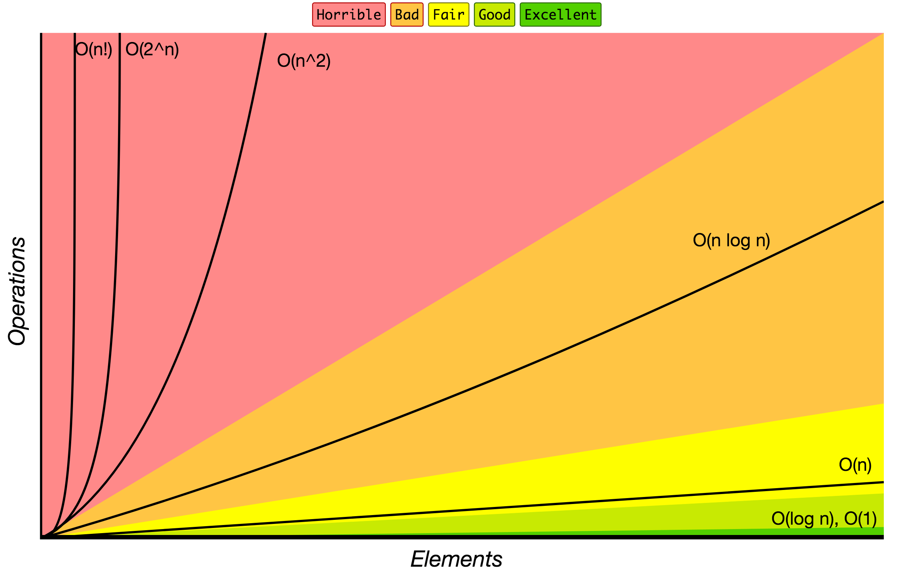

# JavaScript 演算法與資料結構

[](https://github.com/trekhleb/javascript-algorithms/actions?query=workflow%3ACI+branch%3Amaster)
[](https://codecov.io/gh/trekhleb/javascript-algorithms)


這個知識庫包含許多以 JavaScript 為基礎的演算法與資料結構範例。

每個演算法和資料結構都有其獨立的 README，內含相關說明及延伸閱讀連結（包含 YouTube 影片）。

_Read this in other languages:_
[_English_](https://github.com/trekhleb/javascript-algorithms/),
[_简体中文_](README.zh-CN.md),
[_한국어_](README.ko-KR.md),
[_日本語_](README.ja-JP.md),
[_Polski_](README.pl-PL.md),
[_Français_](README.fr-FR.md),
[_Español_](README.es-ES.md),
[_Português_](README.pt-BR.md),
[_Русский_](README.ru-RU.md),
[_Türkçe_](README.tr-TR.md),
[_Italiano_](README.it-IT.md),
[_Bahasa Indonesia_](README.id-ID.md),
[_Українська_](README.uk-UA.md),
[_Arabic_](README.ar-AR.md),
[_Tiếng Việt_](README.vi-VN.md),
[_Deutsch_](README.de-DE.md),
[_Uzbek_](README.uz-UZ.md),
[_עברית_](README.he-IL.md)

## 資料結構

資料結構是一種在電腦中組織和儲存資料的特定方式，使得資料可以被有效率地存取和修改。更精確地說，資料結構是資料值的集合，表示資料之間的關係，以及可以應用於資料上的函數或操作。

`B` - 初學者，`A` - 進階

* `B` [鏈結串列](src/data-structures/linked-list/README.zh-TW.md)
* `B` [雙向鏈結串列](src/data-structures/doubly-linked-list)
* `B` [佇列](src/data-structures/queue/README.zh-TW.md)
* `B` [堆疊](src/data-structures/stack/README.zh-TW.md)
* `B` [雜湊表](src/data-structures/hash-table/README.zh-TW.md)
* `B` [堆積](src/data-structures/heap/README.zh-TW.md) - 最大堆積與最小堆積
* `B` [優先佇列](src/data-structures/priority-queue)
* `A` [字典樹](src/data-structures/trie)
* `A` [樹](src/data-structures/tree/README.zh-TW.md)
  * `A` [二元搜尋樹](src/data-structures/tree/binary-search-tree)
  * `A` [AVL 樹](src/data-structures/tree/avl-tree)
  * `A` [紅黑樹](src/data-structures/tree/red-black-tree)
  * `A` [線段樹](src/data-structures/tree/segment-tree) - 包含最小值/最大值/總和的範圍查詢範例
  * `A` [樹狀數組](src/data-structures/tree/fenwick-tree)（二元索引樹）
* `A` [圖](src/data-structures/graph)（有向圖與無向圖）
* `A` [互斥集](src/data-structures/disjoint-set) - 聯集-查找資料結構或合併-查找集合
* `A` [布隆過濾器](src/data-structures/bloom-filter)
* `A` [LRU 快取](src/data-structures/lru-cache/) - 最近最少使用快取

## 演算法

演算法是解決一類問題的明確規範。演算法是一組精確定義操作序列的規則。

`B` - 初學者，`A` - 進階

### 演算法主題分類

* **數學**
  * `B` [位元運算](src/algorithms/math/bits) - 設定/取得/更新/清除位元、乘以/除以二、變負數等
  * `B` [二進位浮點數](src/algorithms/math/binary-floating-point) - 浮點數的二進位表示法
  * `B` [階乘](src/algorithms/math/factorial)
  * `B` [費波那契數列](src/algorithms/math/fibonacci) - 經典版與封閉公式版
  * `B` [質因數](src/algorithms/math/prime-factors) - 尋找質因數並使用 Hardy-Ramanujan 定理計算質因數個數
  * `B` [質數檢測](src/algorithms/math/primality-test)（試除法）
  * `B` [歐幾里得演算法](src/algorithms/math/euclidean-algorithm) - 計算最大公因數（GCD）
  * `B` [最小公倍數](src/algorithms/math/least-common-multiple)（LCM）
  * `B` [埃拉托斯特尼篩法](src/algorithms/math/sieve-of-eratosthenes) - 尋找指定範圍內的所有質數
  * `B` [二的冪次判斷](src/algorithms/math/is-power-of-two) - 檢查數字是否為二的冪次（原生演算法與位元運算演算法）
  * `B` [巴斯卡三角形](src/algorithms/math/pascal-triangle)
  * `B` [複數](src/algorithms/math/complex-number) - 複數及其基本運算
  * `B` [弧度與角度](src/algorithms/math/radian) - 弧度與角度的互相轉換
  * `B` [快速冪](src/algorithms/math/fast-powering)
  * `B` [霍納法則](src/algorithms/math/horner-method) - 多項式求值
  * `B` [矩陣](src/algorithms/math/matrix) - 矩陣及基本矩陣運算（乘法、轉置等）
  * `B` [歐幾里得距離](src/algorithms/math/euclidean-distance) - 兩點/向量/矩陣之間的距離
  * `A` [整數拆分](src/algorithms/math/integer-partition)
  * `A` [平方根](src/algorithms/math/square-root) - 牛頓法
  * `A` [劉徽割圓術](src/algorithms/math/liu-hui) - 基於 N 邊形的近似圓周率計算
  * `A` [離散傅立葉轉換](src/algorithms/math/fourier-transform) - 將時間訊號分解為組成它的各個頻率
* **集合**
  * `B` [笛卡爾積](src/algorithms/sets/cartesian-product) - 多個集合的乘積
  * `B` [洗牌演算法](src/algorithms/sets/fisher-yates) - 隨機置換有限序列
  * `A` [冪集合](src/algorithms/sets/power-set) - 集合的所有子集（位元運算、回溯法與遞推法）
  * `A` [排列](src/algorithms/sets/permutations)（有/無重複）
  * `A` [組合](src/algorithms/sets/combinations)（有/無重複）
  * `A` [最長共同子序列](src/algorithms/sets/longest-common-subsequence)（LCS）
  * `A` [最長遞增子序列](src/algorithms/sets/longest-increasing-subsequence)
  * `A` [最短共同超序列](src/algorithms/sets/shortest-common-supersequence)（SCS）
  * `A` [背包問題](src/algorithms/sets/knapsack-problem) - 「0/1」與「無限」版本
  * `A` [最大子序列](src/algorithms/sets/maximum-subarray) - 暴力法與動態規劃（Kadane's）版本
  * `A` [組合總和](src/algorithms/sets/combination-sum) - 找出所有構成特定總和的組合
* **字串**
  * `B` [漢明距離](src/algorithms/string/hamming-distance) - 符號不同的位置數
  * `B` [迴文](src/algorithms/string/palindrome) - 檢查字串是否為迴文
  * `A` [萊文斯坦距離](src/algorithms/string/levenshtein-distance) - 兩個序列之間的最小編輯距離
  * `A` [KMP 演算法](src/algorithms/string/knuth-morris-pratt)（Knuth-Morris-Pratt）- 子字串搜尋（模式匹配）
  * `A` [Z 演算法](src/algorithms/string/z-algorithm) - 子字串搜尋（模式匹配）
  * `A` [Rabin-Karp 演算法](src/algorithms/string/rabin-karp) - 子字串搜尋
  * `A` [最長共同子字串](src/algorithms/string/longest-common-substring)
  * `A` [正規表達式匹配](src/algorithms/string/regular-expression-matching)
* **搜尋**
  * `B` [線性搜尋](src/algorithms/search/linear-search)
  * `B` [跳躍搜尋](src/algorithms/search/jump-search)（或區塊搜尋）- 在已排序陣列中搜尋
  * `B` [二元搜尋](src/algorithms/search/binary-search) - 在已排序陣列中搜尋
  * `B` [內插搜尋](src/algorithms/search/interpolation-search) - 在均勻分佈的已排序陣列中搜尋
* **排序**
  * `B` [氣泡排序](src/algorithms/sorting/bubble-sort)
  * `B` [選擇排序](src/algorithms/sorting/selection-sort)
  * `B` [插入排序](src/algorithms/sorting/insertion-sort)
  * `B` [堆積排序](src/algorithms/sorting/heap-sort)
  * `B` [合併排序](src/algorithms/sorting/merge-sort)
  * `B` [快速排序](src/algorithms/sorting/quick-sort) - 原地（in-place）與非原地版本
  * `B` [希爾排序](src/algorithms/sorting/shell-sort)
  * `B` [計數排序](src/algorithms/sorting/counting-sort)
  * `B` [基數排序](src/algorithms/sorting/radix-sort)
  * `B` [桶排序](src/algorithms/sorting/bucket-sort)
* **鏈結串列**
  * `B` [正向走訪](src/algorithms/linked-list/traversal)
  * `B` [反向走訪](src/algorithms/linked-list/reverse-traversal)
* **樹**
  * `B` [深度優先搜尋](src/algorithms/tree/depth-first-search)（DFS）
  * `B` [廣度優先搜尋](src/algorithms/tree/breadth-first-search)（BFS）
* **圖**
  * `B` [深度優先搜尋](src/algorithms/graph/depth-first-search)（DFS）
  * `B` [廣度優先搜尋](src/algorithms/graph/breadth-first-search)（BFS）
  * `B` [Kruskal 演算法](src/algorithms/graph/kruskal) - 尋找加權無向圖的最小生成樹（MST）
  * `A` [Dijkstra 演算法](src/algorithms/graph/dijkstra) - 從單一頂點找到所有圖頂點的最短路徑
  * `A` [Bellman-Ford 演算法](src/algorithms/graph/bellman-ford) - 從單一頂點找到所有圖頂點的最短路徑
  * `A` [Floyd-Warshall 演算法](src/algorithms/graph/floyd-warshall) - 找到所有頂點對之間的最短路徑
  * `A` [偵測環](src/algorithms/graph/detect-cycle) - 針對有向圖與無向圖（基於 DFS 和互斥集的版本）
  * `A` [Prim 演算法](src/algorithms/graph/prim) - 尋找加權無向圖的最小生成樹（MST）
  * `A` [拓撲排序](src/algorithms/graph/topological-sorting) - DFS 方法
  * `A` [關節點](src/algorithms/graph/articulation-points) - Tarjan 演算法（基於 DFS）
  * `A` [橋](src/algorithms/graph/bridges) - 基於 DFS 的演算法
  * `A` [尤拉路徑與尤拉迴路](src/algorithms/graph/eulerian-path) - Fleury 演算法 - 恰好經過每條邊一次
  * `A` [漢彌爾頓迴路](src/algorithms/graph/hamiltonian-cycle) - 恰好造訪每個頂點一次
  * `A` [強連通分量](src/algorithms/graph/strongly-connected-components) - Kosaraju 演算法
  * `A` [旅行推銷員問題](src/algorithms/graph/travelling-salesman) - 盡可能以最短路線造訪每座城市並返回出發城市
* **密碼學**
  * `B` [多項式雜湊](src/algorithms/cryptography/polynomial-hash) - 基於多項式的滾動雜湊函數
  * `B` [柵欄密碼](src/algorithms/cryptography/rail-fence-cipher) - 一種用於編碼訊息的轉置密碼演算法
  * `B` [凱薩密碼](src/algorithms/cryptography/caesar-cipher) - 簡單替換密碼
  * `B` [希爾密碼](src/algorithms/cryptography/hill-cipher) - 基於線性代數的替換密碼
* **機器學習**
  * `B` [NanoNeuron](https://github.com/trekhleb/nano-neuron) - 7 個簡單的 JS 函數，說明機器如何實際學習（前向/反向傳播）
  * `B` [k-近鄰演算法](src/algorithms/ml/knn) - k-最近鄰分類演算法
  * `B` [k-平均演算法](src/algorithms/ml/k-means) - k-平均分群演算法
* **影像處理**
  * `B` [接縫裁剪](src/algorithms/image-processing/seam-carving) - 內容感知圖片縮放演算法
* **統計**
  * `B` [加權隨機](src/algorithms/statistics/weighted-random) - 根據項目的權重從列表中選取隨機項目
* **演化演算法**
  * `A` [遺傳演算法](https://github.com/trekhleb/self-parking-car-evolution) - 遺傳演算法如何應用於自動停車訓練的範例
* **未分類**
  * `B` [河內塔](src/algorithms/uncategorized/hanoi-tower)
  * `B` [方陣旋轉](src/algorithms/uncategorized/square-matrix-rotation) - 原地演算法
  * `B` [跳躍遊戲](src/algorithms/uncategorized/jump-game) - 回溯法、動態規劃（由上而下與由下而上）與貪婪法範例
  * `B` [唯一路徑](src/algorithms/uncategorized/unique-paths) - 回溯法、動態規劃與巴斯卡三角形範例
  * `B` [雨水收集](src/algorithms/uncategorized/rain-terraces) - 接雨水問題（動態規劃與暴力法版本）
  * `B` [遞迴階梯](src/algorithms/uncategorized/recursive-staircase) - 計算到達頂層共有多少種方法（4 種解法）
  * `B` [最佳股票買賣時機](src/algorithms/uncategorized/best-time-to-buy-sell-stocks) - 分治法與一次遍歷範例
  * `B` [有效括號](src/algorithms/stack/valid-parentheses) - 檢查字串是否包含有效括號（使用堆疊）
  * `A` [N 皇后問題](src/algorithms/uncategorized/n-queens)
  * `A` [騎士巡邏](src/algorithms/uncategorized/knight-tour)

### 演算法範型

演算法範型是一種設計一類底層演算法的泛用方法或途徑。它是比演算法更高階的抽象化，就如同演算法是比電腦程式更高階的抽象化一樣。

* **暴力法** - 尋遍所有可能解，然後選取最佳解
  * `B` [線性搜尋](src/algorithms/search/linear-search)
  * `B` [雨水收集](src/algorithms/uncategorized/rain-terraces) - 接雨水問題
  * `B` [遞迴階梯](src/algorithms/uncategorized/recursive-staircase) - 計算到達頂層的方法數
  * `A` [最大子序列](src/algorithms/sets/maximum-subarray)
  * `A` [旅行推銷員問題](src/algorithms/graph/travelling-salesman) - 盡可能以最短路線造訪每座城市並返回出發城市
  * `A` [離散傅立葉轉換](src/algorithms/math/fourier-transform) - 將時間訊號分解為組成它的各個頻率
* **貪婪法** - 在當前選擇最佳選項，不考慮未來的情況
  * `B` [跳躍遊戲](src/algorithms/uncategorized/jump-game)
  * `A` [無限背包問題](src/algorithms/sets/knapsack-problem)
  * `A` [Dijkstra 演算法](src/algorithms/graph/dijkstra) - 找到所有圖頂點的最短路徑
  * `A` [Prim 演算法](src/algorithms/graph/prim) - 尋找加權無向圖的最小生成樹（MST）
  * `A` [Kruskal 演算法](src/algorithms/graph/kruskal) - 尋找加權無向圖的最小生成樹（MST）
* **分治法** - 將問題分成較小的部分，然後解決這些部分
  * `B` [二元搜尋](src/algorithms/search/binary-search)
  * `B` [河內塔](src/algorithms/uncategorized/hanoi-tower)
  * `B` [巴斯卡三角形](src/algorithms/math/pascal-triangle)
  * `B` [歐幾里得演算法](src/algorithms/math/euclidean-algorithm) - 計算最大公因數（GCD）
  * `B` [合併排序](src/algorithms/sorting/merge-sort)
  * `B` [快速排序](src/algorithms/sorting/quick-sort)
  * `B` [樹深度優先搜尋](src/algorithms/tree/depth-first-search)（DFS）
  * `B` [圖深度優先搜尋](src/algorithms/graph/depth-first-search)（DFS）
  * `B` [矩陣](src/algorithms/math/matrix) - 產生與走訪不同形狀的矩陣
  * `B` [跳躍遊戲](src/algorithms/uncategorized/jump-game)
  * `B` [快速冪](src/algorithms/math/fast-powering)
  * `B` [最佳股票買賣時機](src/algorithms/uncategorized/best-time-to-buy-sell-stocks) - 分治法與一次遍歷範例
  * `A` [排列](src/algorithms/sets/permutations)（有/無重複）
  * `A` [組合](src/algorithms/sets/combinations)（有/無重複）
  * `A` [最大子序列](src/algorithms/sets/maximum-subarray)
* **動態規劃** - 利用先前找到的子問題解來建構解答
  * `B` [費波那契數列](src/algorithms/math/fibonacci)
  * `B` [跳躍遊戲](src/algorithms/uncategorized/jump-game)
  * `B` [唯一路徑](src/algorithms/uncategorized/unique-paths)
  * `B` [雨水收集](src/algorithms/uncategorized/rain-terraces) - 接雨水問題
  * `B` [遞迴階梯](src/algorithms/uncategorized/recursive-staircase) - 計算到達頂層的方法數
  * `B` [接縫裁剪](src/algorithms/image-processing/seam-carving) - 內容感知圖片縮放演算法
  * `A` [萊文斯坦距離](src/algorithms/string/levenshtein-distance) - 兩個序列之間的最小編輯距離
  * `A` [最長共同子序列](src/algorithms/sets/longest-common-subsequence)（LCS）
  * `A` [最長共同子字串](src/algorithms/string/longest-common-substring)
  * `A` [最長遞增子序列](src/algorithms/sets/longest-increasing-subsequence)
  * `A` [最短共同超序列](src/algorithms/sets/shortest-common-supersequence)
  * `A` [0/1 背包問題](src/algorithms/sets/knapsack-problem)
  * `A` [整數拆分](src/algorithms/math/integer-partition)
  * `A` [最大子序列](src/algorithms/sets/maximum-subarray)
  * `A` [Bellman-Ford 演算法](src/algorithms/graph/bellman-ford) - 找到所有圖頂點的最短路徑
  * `A` [Floyd-Warshall 演算法](src/algorithms/graph/floyd-warshall) - 找到所有頂點對之間的最短路徑
  * `A` [正規表達式匹配](src/algorithms/string/regular-expression-matching)
* **回溯法** - 與暴力法類似，嘗試產生所有可能的解，但每次產生下一個解時，會先測試是否滿足所有條件，只有滿足條件才繼續產生後續的解。否則回溯並嘗試其他路徑。通常會使用狀態空間的 DFS 走訪。
  * `B` [跳躍遊戲](src/algorithms/uncategorized/jump-game)
  * `B` [唯一路徑](src/algorithms/uncategorized/unique-paths)
  * `B` [冪集合](src/algorithms/sets/power-set) - 集合的所有子集
  * `A` [漢彌爾頓迴路](src/algorithms/graph/hamiltonian-cycle) - 恰好造訪每個頂點一次
  * `A` [N 皇后問題](src/algorithms/uncategorized/n-queens)
  * `A` [騎士巡邏](src/algorithms/uncategorized/knight-tour)
  * `A` [組合總和](src/algorithms/sets/combination-sum) - 找出所有構成特定總和的組合
* **分支定界法** - 記住回溯搜尋過程中每個階段找到的最低成本解，並以目前已找到的最低成本作為下界，捨棄成本高於此下界的部分解。通常結合狀態空間樹的 BFS 與 DFS 走訪來使用。

## 如何使用本知識庫

**安裝所有必要套件**

```
npm install
```

**執行 ESLint**

你可以執行它來檢查程式碼品質。

```
npm run lint
```

**執行所有測試**

```
npm test
```

**依名稱執行測試**

```
npm test -- 'LinkedList'
```

**疑難排解**

如果 lint 或測試執行失敗，可以嘗試刪除 `node_modules` 資料夾並重新安裝 npm 套件：

```
rm -rf ./node_modules
npm i
```

另外，請確認你使用的是正確的 Node 版本（`>=16`）。如果你使用 [nvm](https://github.com/nvm-sh/nvm) 來管理 Node 版本，可以在專案根目錄執行 `nvm use`，它會自動使用正確的版本。

**練習場**

你可以在 `./src/playground/playground.js` 檔案中練習資料結構與演算法，並在 `./src/playground/__test__/playground.test.js` 中撰寫測試程式。

接著執行下列指令來測試你的練習程式碼是否如預期運作：

```
npm test -- 'playground'
```

## 有用的資訊

### 參考資料

- [▶ YouTube 上的資料結構與演算法](https://www.youtube.com/playlist?list=PLLXdhg_r2hKA7DPDsunoDZ-Z769jWn4R8)
- [✍🏻 資料結構草圖](https://okso.app/showcase/data-structures)

### Big O 標記法

*Big O 標記法*用於根據輸入資料規模的增長，來分類演算法的執行時間或空間需求的增長趨勢。在下方圖表中，你可以找到以 Big O 標記法表示的最常見演算法增長階數。



資料來源：[Big O Cheat Sheet](http://bigocheatsheet.com/)。

以下列出幾個常用的 Big O 標記法，以及其在不同資料量輸入下的運算效能比較。

| Big O 標記法   | 類型        | 10 個元素的計算量 | 100 個元素的計算量 | 1000 個元素的計算量 |
| -------------- | ----------- | ----------------: | -----------------: | ------------------: |
| **O(1)**       | 常數        | 1                 | 1                  | 1                   |
| **O(log N)**   | 對數        | 3                 | 6                  | 9                   |
| **O(N)**       | 線性        | 10                | 100                | 1000                |
| **O(N log N)** | n log(n)    | 30                | 600                | 9000                |
| **O(N^2)**     | 平方        | 100               | 10000              | 1000000             |
| **O(2^N)**     | 指數        | 1024              | 1.26e+29           | 1.07e+301           |
| **O(N!)**      | 階乘        | 3628800           | 9.3e+157           | 4.02e+2567          |

### 資料結構操作複雜度

| 資料結構                | 存取      | 搜尋      | 插入      | 刪除      | 備註      |
| ----------------------- | :-------: | :-------: | :-------: | :-------: | :-------- |
| **陣列**                | 1         | n         | n         | n         |           |
| **堆疊**                | n         | n         | 1         | 1         |           |
| **佇列**                | n         | n         | 1         | 1         |           |
| **鏈結串列**            | n         | n         | 1         | n         |           |
| **雜湊表**              | -         | n         | n         | n         | 在完美雜湊函數的情況下，複雜度為 O(1) |
| **二元搜尋樹**          | n         | n         | n         | n         | 在平衡樹的情況下，複雜度為 O(log(n)) |
| **B 樹**                | log(n)    | log(n)    | log(n)    | log(n)    |           |
| **紅黑樹**              | log(n)    | log(n)    | log(n)    | log(n)    |           |
| **AVL 樹**              | log(n)    | log(n)    | log(n)    | log(n)    |           |
| **布隆過濾器**          | -         | 1         | 1         | -         | 搜尋時可能產生偽陽性 |

### 陣列排序演算法複雜度

| 名稱                   | 最佳            | 平均                | 最差                | 記憶體    | 穩定      | 備註      |
| ---------------------- | :-------------: | :-----------------: | :-----------------: | :-------: | :-------: | :-------- |
| **氣泡排序**           | n               | n<sup>2</sup>       | n<sup>2</sup>       | 1         | Yes       |           |
| **插入排序**           | n               | n<sup>2</sup>       | n<sup>2</sup>       | 1         | Yes       |           |
| **選擇排序**           | n<sup>2</sup>   | n<sup>2</sup>       | n<sup>2</sup>       | 1         | No        |           |
| **堆積排序**           | n&nbsp;log(n)   | n&nbsp;log(n)       | n&nbsp;log(n)       | 1         | No        |           |
| **合併排序**           | n&nbsp;log(n)   | n&nbsp;log(n)       | n&nbsp;log(n)       | n         | Yes       |           |
| **快速排序**           | n&nbsp;log(n)   | n&nbsp;log(n)       | n<sup>2</sup>       | log(n)    | No        | 快速排序通常以原地方式進行，使用 O(log(n)) 的堆疊空間 |
| **希爾排序**           | n&nbsp;log(n)   | 取決於間隔序列      | n&nbsp;(log(n))<sup>2</sup> | 1  | No        |           |
| **計數排序**           | n + r           | n + r               | n + r               | n + r     | Yes       | r - 陣列中最大的數 |
| **基數排序**           | n * k           | n * k               | n * k               | n + k     | Yes       | k - 最長鍵值的長度 |

> ℹ️ 更多關於 JavaScript 和演算法的[專案](https://trekhleb.dev/projects/)與[文章](https://trekhleb.dev/blog/)，請參考 [trekhleb.dev](https://trekhleb.dev)
