# Dijkstra 算法

_阅读其他语言版本：_
[_English_](README.md),
[_한국어_](README.ko-KR.md),
[_日本語_](README.ja-JP.md),
[_简体中文_](README.zh-CN.md),
[_繁體中文_](README.zh-TW.md),
[_Українська_](README.uk-UA.md),
[_Español_](README.es-ES.md),
[_Français_](README.fr-FR.md),
[_Deutsch_](README.de-DE.md),
[_עברית_](README.he-IL.md)

Dijkstra 算法是一种用于在图中查找节点之间最短路径的算法，例如，它可以用于表示道路网络。

该算法有许多变体；Dijkstra 的原始版本用于查找两个节点之间的最短路径，但更常见的变体是将一个节点固定为“源节点”，并计算从该源节点到图中所有其他节点的最短路径，从而生成最短路径树。

Dijkstra 算法用于查找从 `a` 到 `b` 的最短路径。
它选择未访问的距离最小的节点，计算通过它到每个未访问邻居的距离，
如果更短，则更新邻居的距离。
当该节点的所有邻居都被处理完后，将其标记为已访问（红色）。

## Dijkstra 算法的实际应用

- GPS / 导航系统
- 公共交通和航线优化
- 互联网路由（OSPF、IS-IS 协议）
- 网络流量与延迟优化
- 游戏路径寻路（地图上的最短路径）
- 物流与配送路线优化
- 供应链与交通网络设计

## Dijkstra 算法逐步示例

假设我们有一个带权图，每条边表示节点之间的距离。
例如，节点 `A` 和节点 `B` 之间的距离是 `7 米`（简称 `7m`）。

算法使用 [优先队列](../../../data-structures/priority-queue/) 来始终提取离起始节点距离最短的未访问节点。

起始节点与自身的距离定义为 `0m`。因此我们从它开始，这是优先队列中的唯一节点。

在遍历图的过程中（访问邻居节点时），其余节点会逐渐被添加到优先队列中。

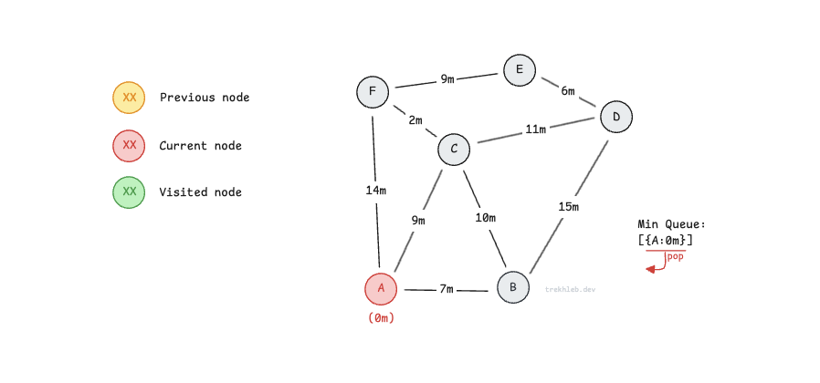

从队列中取出的节点的每个邻居都会被遍历，以计算从起点到该邻居的距离。
例如，从 `A` 到 `B` 的距离为 `0m + 7m = 7m`。

每次访问尚未访问的邻居时，将其加入优先队列，优先级为从起点到该节点的距离。

节点 `B` 被加入最小优先队列，以便稍后遍历。

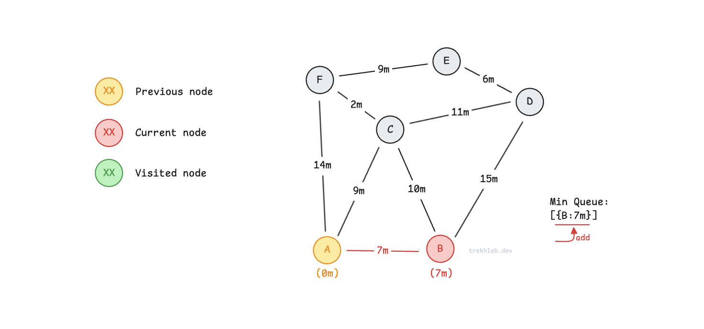

接着访问节点 `A` 的另一个邻居 `C`。
从起始节点 `A` 到 `C` 的距离为 `0m + 9m = 9m`。

节点 `C` 被加入最小优先队列，等待后续遍历。

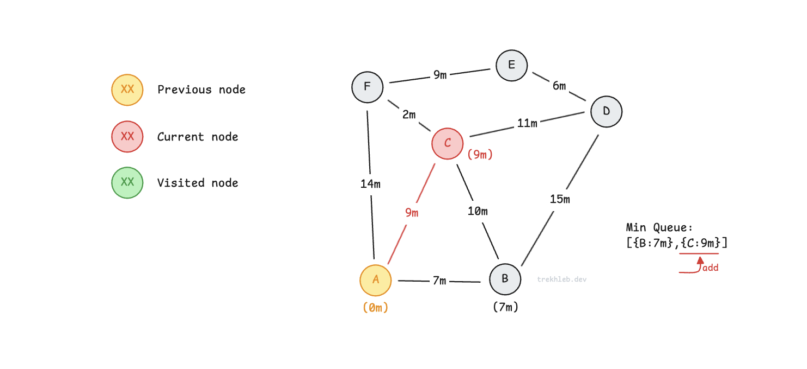

同样地，对于节点 `F`，从起始节点 `A` 的当前距离是 `0m + 14m = 14m`。

节点 `F` 被加入最小优先队列，等待后续遍历。

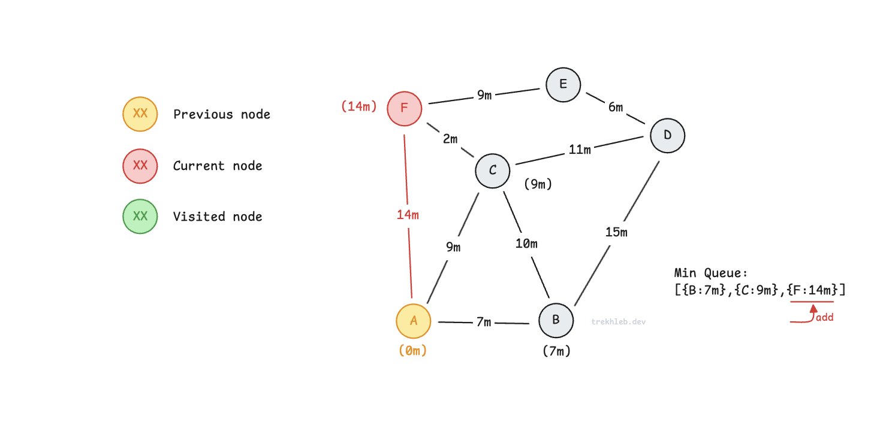

当当前节点的所有邻居都被检查完后，将当前节点添加到 `visited` 集合中。
在后续遍历中不会再次访问这些节点。

现在，从优先队列中取出离起点最近（距离最短）的节点，开始访问它的邻居。

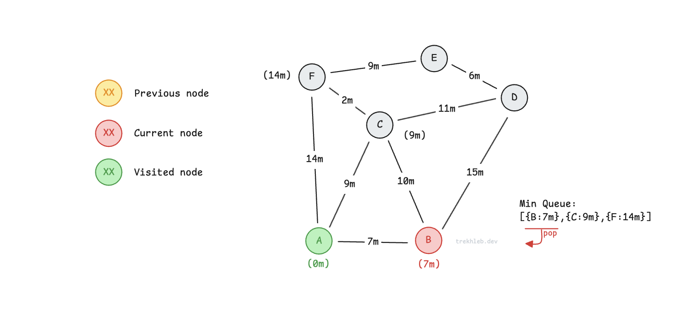

如果正在访问的节点（此处为 `C`）已经在队列中，
表示之前通过另一条路径（`A → C`）已计算过其距离。
如果当前路径（`A → B → C`）的距离更短，则更新距离；
否则保持原状。

例如，通过 `B` 访问 `C`（路径 `A → B → C`），距离为 `7m + 10m = 17m`。
这比已记录的 `A → C` 路径的 `9m` 更长，因此忽略。

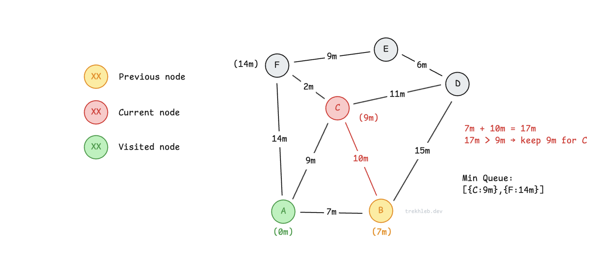

访问 `B` 的另一个邻居 `D`。
到 `D` 的距离为 `7m + 15m = 22m`。
由于 `D` 尚未访问，也不在队列中，因此将其以距离 `22m` 的优先级加入队列。

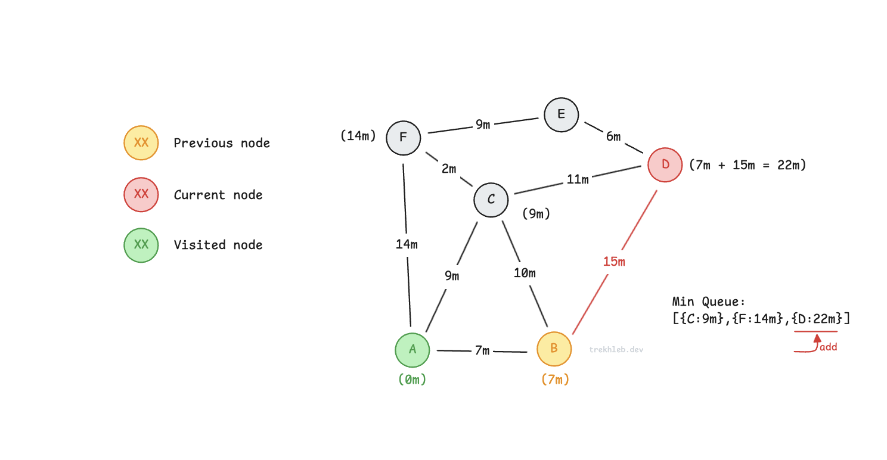

此时，`B` 的所有邻居都已遍历，因此将 `B` 添加到 `visited` 集合中。
接着，从优先队列中取出离起始节点最近的节点。

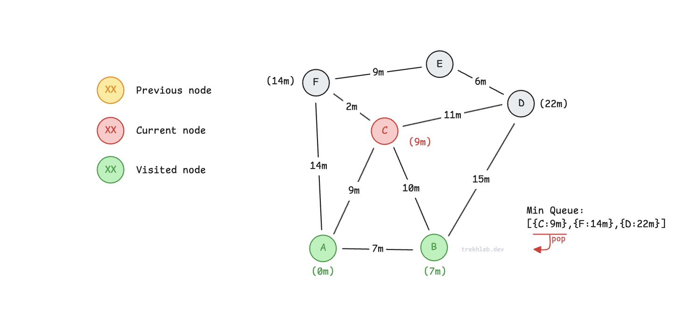

遍历节点 `C` 的未访问邻居。
通过 `C` 到 `F` 的路径（`A → C → F`）距离为 `9m + 2m = 11m`。
这比之前记录的路径 `A → F`（`14m`）更短。
因此，将 `F` 的距离更新为 `11m`，并在队列中调整其优先级。
我们找到了到 `F` 的更短路径。

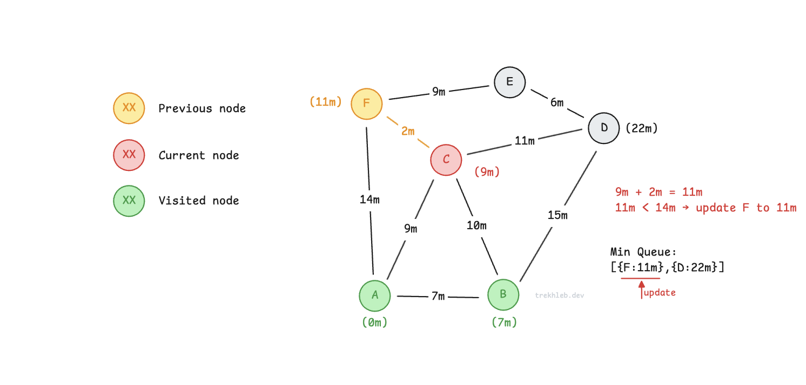

对于 `D` 也是如此。
路径 `A → C → D` 比 `A → B → D` 更短，
因此将距离从 `22m` 更新为 `20m`。

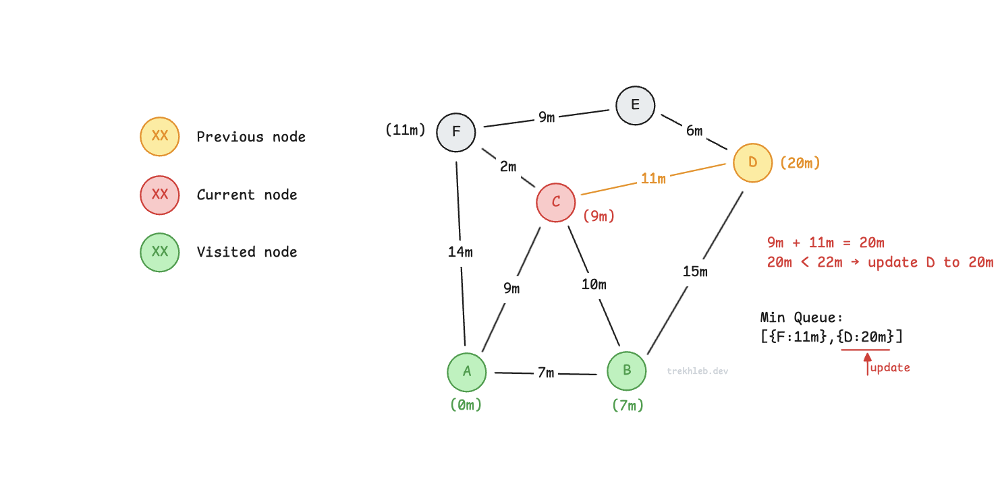

`C` 的所有邻居都已遍历完，将其加入 `visited`。
然后从队列中取出下一个最近的节点 `F`。

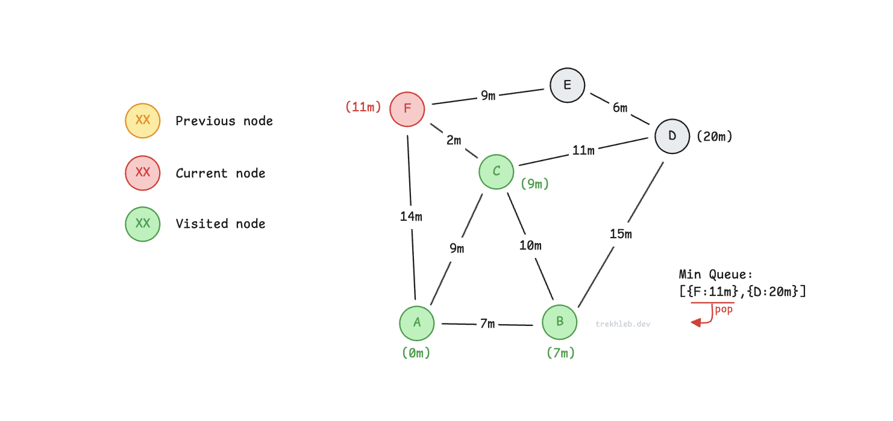

记录到 `E` 的距离：`11m + 9m = 20m`。

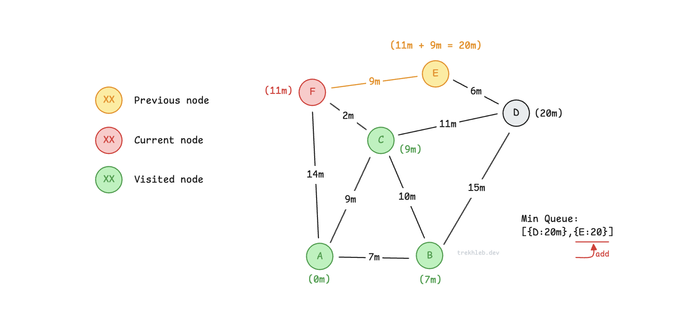

将节点 `F` 添加到 `visited` 集合中，并从队列中取出下一个最近的节点 `D`。

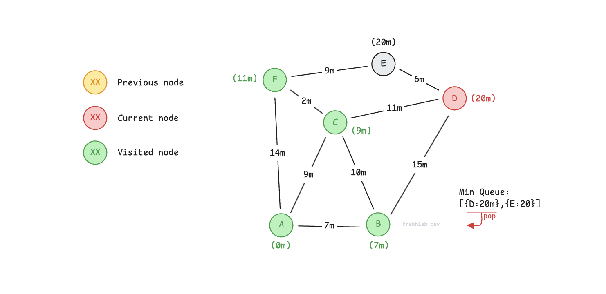

通过 `D` 到 `E` 的距离为 `20m + 6m = 26m`。
这比通过 `F` 的 `20m` 更长，因此忽略。

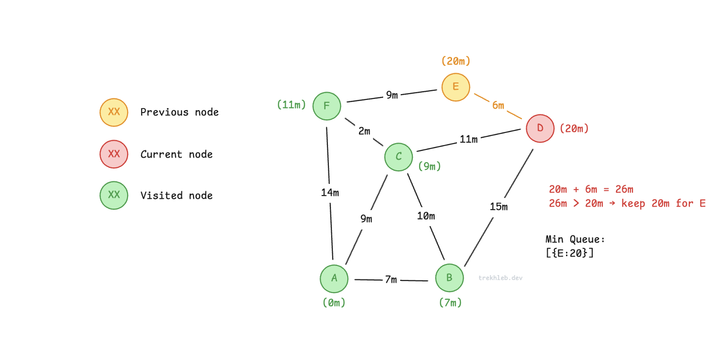

节点 `D` 已访问。

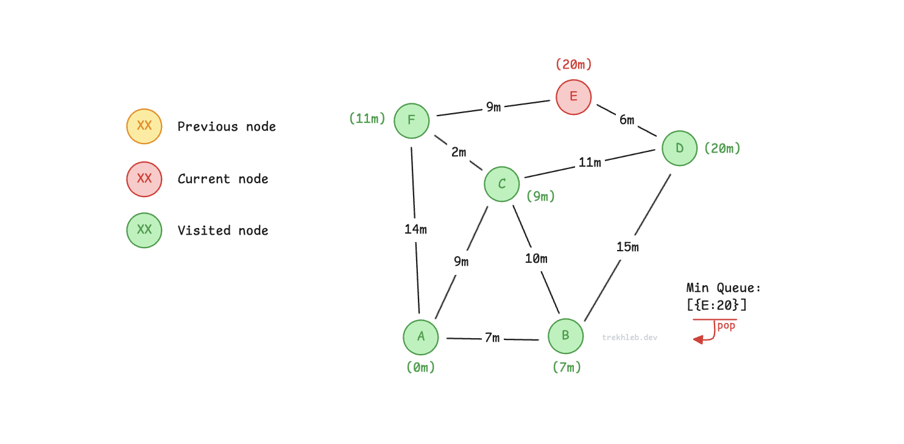

节点 `E` 也已访问。
图的遍历完成。

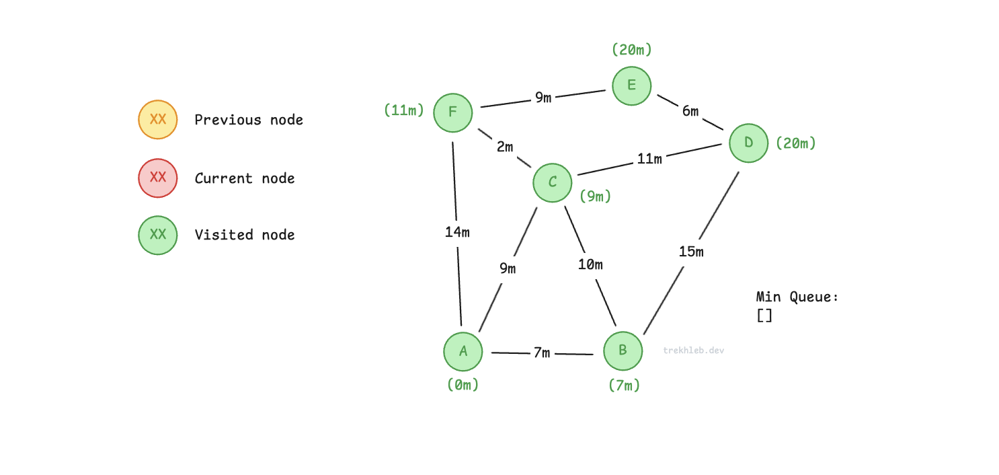

现在，我们已经知道从起始节点 `A` 到每个节点的最短距离。

在实际应用中，在计算距离的同时，还会记录每个节点的 `previousVertices`（前驱节点），
以便重建形成最短路径的节点序列。

例如，从 `A` 到 `E` 的最短路径为 `A → C → F → E`。

## 实现示例

- [dijkstra.js](./dijkstra.js)

## 参考资料

- [维基百科](https://zh.wikipedia.org/wiki/Dijkstra算法)
- [YouTube - Nathaniel Fan](https://www.youtube.com/watch?v=gdmfOwyQlcI&list=PLLXdhg_r2hKA7DPDsunoDZ-Z769jWn4R8)
- [YouTube - Tushar Roy](https://www.youtube.com/watch?v=lAXZGERcDf4&list=PLLXdhg_r2hKA7DPDsunoDZ-Z769jWn4R8)
