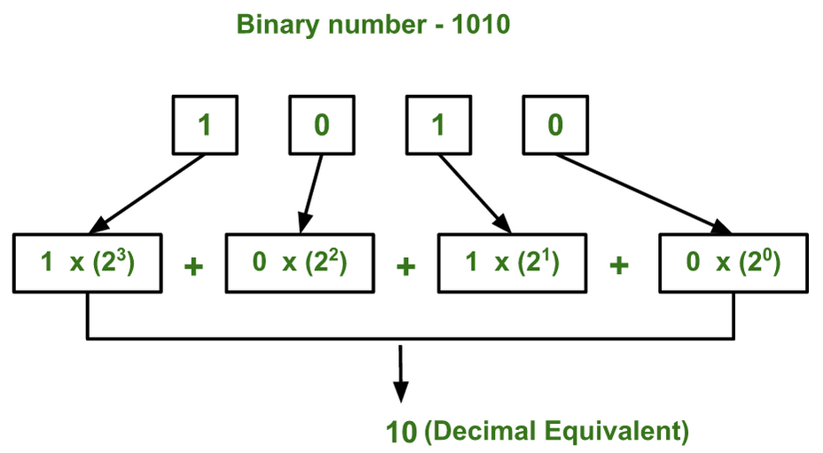
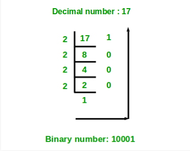

# Conversion of Binary number to Decimal number
Given a binary number as input, we need to write a program to convert the given binary number into equivalent decimal number.

The idea is to extract the digits of given binary number starting from right most digit and keep a variable decimal_value. At the time of extracting digits from the binary number, multiply the digit with the proper base (Power of 2) and add it to the variable decimal_value. At the end, the variable decimal_value will store the required decimal number.

For Example:
If the binary number is 111.
decimal_value = 1*(2^2) + 1*(2^1) + 1*(2^0) = 7

## Reference
<a href="https://www.youtube.com/watch?v=meGcdIoTYgw">Youtube</a>

# Conversion of Decimal number to Binary number
Given a decimal number as input, we need to write a program to convert the given decimal number into equivalent binary number.

  Store the remainder when the number is divided by 2 in an array.
  Divide the number by 2
  Repeat the above two steps until the number is greater than zero.
  Print the array in reverse order now.

For Example:
If the binary number is 10.
Step 1: Remainder when 10 is divided by 2 is zero. Therefore, arr[0] = 0.
Step 2: Divide 10 by 2. New number is 10/2 = 5.
Step 3: Remainder when 5 is divided by 2 is 1. Therefore, arr[1] = 1.
Step 4: Divide 5 by 2. New number is 5/2 = 2.
Step 5: Remainder when 2 is divided by 2 is zero. Therefore, arr[2] = 0.
Step 6: Divide 2 by 2. New number is 2/2 = 1.
Step 7: Remainder when 1 is divided by 2 is 1. Therefore, arr[3] = 1.
Step 8: Divide 1 by 2. New number is 1/2 = 0.
Step 9: Since number becomes = 0. Print the array in reverse order. Therefore the equivalent binary number is 1010.

## Reference
<a href="https://www.youtube.com/watch?v=mW8NIJ6Ns8k">Youtube</a>
