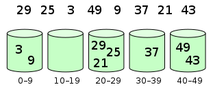
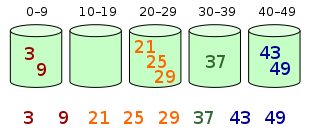

# Bucket Sort

**Bucket sort**, or **bin sort**, is a sorting algorithm that works by distributing the elements of an array into a number of buckets. Each bucket is then sorted individually, either using a different sorting algorithm, or by recursively applying the bucket sorting algorithm.

## Algorithm

Bucket sort works as follows:

1. Set up an array of initially empty `buckets`.
2. **Scatter:** Go over the original array, putting each object in its `bucket`.
3. Sort each non-empty `bucket`.
4. **Gather:** Visit the `buckets` in order and put all elements back into the original array.

Elements are distributed among bins:

Then, elements are sorted within each bin:

## Complexity

The computational complexity depends on the algorithm used to sort each bucket, the number of buckets to use, and whether the input is uniformly distributed.

The **worst-case** time complexity of bucket sort is
`O(n^2)` if the sorting algorithm used on the bucket is *insertion sort*, which is the most common use case since the expectation is that buckets will not have too many elements relative to the entire list. In the worst case, all elements are placed in one bucket, causing the running time to reduce to the worst-case complexity of insertion sort (all elements are in reverse order). If the worst-case running time of the intermediate sort used is `O(n * log(n))`, then the worst-case running time of bucket sort will also be
`O(n * log(n))`.

On **average**, when the distribution of elements across buckets is reasonably uniform, it can be shown that bucket sort runs on average `O(n + k)` for `k` buckets.

## References

- [Bucket Sort on Wikipedia](https://en.wikipedia.org/wiki/Bucket_sort)
