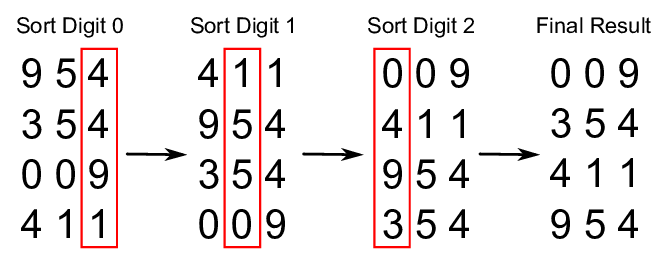

# Radix Sort

_Read this in other languages:_
[_Português_](README.pt-BR.md),

In computer science, **radix sort** is a non-comparative integer sorting
algorithm that sorts data with integer keys by grouping keys by the individual
digits which share the same significant position and value. A positional notation
is required, but because integers can represent strings of characters
(e.g., names or dates) and specially formatted floating point numbers, radix
sort is not limited to integers.

*Where does the name come from?*

In mathematical numeral systems, the *radix* or base is the number of unique digits,
including the digit zero, used to represent numbers in a positional numeral system.
For example, a binary system (using numbers 0 and 1) has a radix of 2 and a decimal
system (using numbers 0 to 9) has a radix of 10.

## Efficiency

The topic of the efficiency of radix sort compared to other sorting algorithms is
somewhat tricky and subject to quite a lot of misunderstandings. Whether radix
sort is equally efficient, less efficient or more efficient than the best
comparison-based algorithms depends on the details of the assumptions made.
Radix sort complexity is `O(wn)` for `n` keys which are integers of word size `w`.
Sometimes `w` is presented as a constant, which would make radix sort better
(for sufficiently large `n`) than the best comparison-based sorting algorithms,
which all perform `O(n log n)` comparisons to sort `n` keys. However, in
general `w` cannot be considered a constant: if all `n` keys are distinct,
then `w` has to be at least `log n` for a random-access machine to be able to
store them in memory, which gives at best a time complexity `O(n log n)`. That
would seem to make radix sort at most equally efficient as the best
comparison-based sorts (and worse if keys are much longer than `log n`).

## Complexity

| Name                  | Best            | Average             | Worst               | Memory    | Stable    | Comments  |
| --------------------- | :-------------: | :-----------------: | :-----------------: | :-------: | :-------: | :-------- |
| **Radix sort**        | n * k           | n * k               | n * k               | n + k     | Yes       | k - length of longest key |

## References

- [Wikipedia](https://en.wikipedia.org/wiki/Radix_sort)
- [YouTube](https://www.youtube.com/watch?v=XiuSW_mEn7g&index=62&t=0s&list=PLLXdhg_r2hKA7DPDsunoDZ-Z769jWn4R8)
- [ResearchGate](https://www.researchgate.net/figure/Simplistic-illustration-of-the-steps-performed-in-a-radix-sort-In-this-example-the_fig1_291086231)
