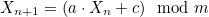
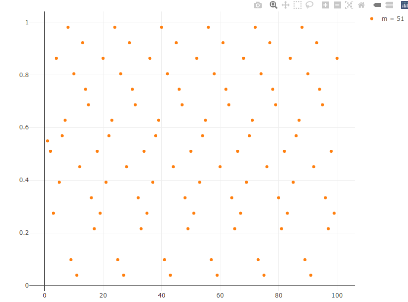
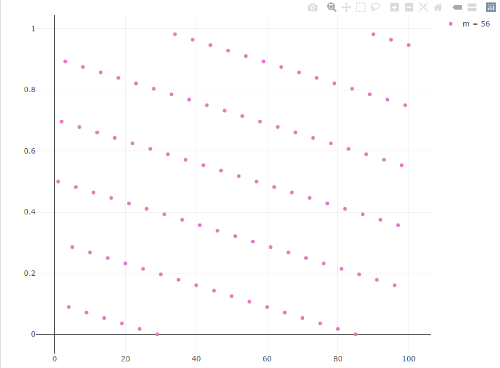

# Linear congruential generator

## What is a linear congruential generator? 

A Linear congruential generator can be used to generate a sequence of pseudorandom numbers using simple mathematics. 



## Choice of Parameters

The sequence is recurrent with a certain periodicity as seen in the images below.
The x-axis is the n-th iteration while the numbers divided by m are on the y-axis, which results in pseudorandom numbers between 0-1.  




Depending on the input parameters different period lengths may appear. In these examples only m was changed with parameters a=57, c=11, seed=28.
The disadvantages are clearly visible as the future values could be predicted easily or even the entire sequence while depending on well-chosen values.   

According to Knuth, maximum period length m can be achieved meeting following conditions: 

1. c and m are coprime
2. Each prime divisor p of m divides a-1
3. If 4 divides m, then 4 divides a-1


```javascript

// A Linear Congruence Generator for a sequence of n pseudorandom numbers with given parameters
function lcg(a, c, m, seed, n = 1) {
  if (m < 2) throw new Error('m must be greater than 1');
  if (a < 0 || a >= m) throw new Error('a must be between 0 and m-1');
  if (c < 0 || c >= m) throw new Error('c must be between 0 and m-1');
  let result = [];

  for (let i = 0, x=seed; i < n; i++) {
    let random_number = (a * x + c) % m;
    result.push(random_number/m);
    x = random_number;
  }
  return result;
}

```