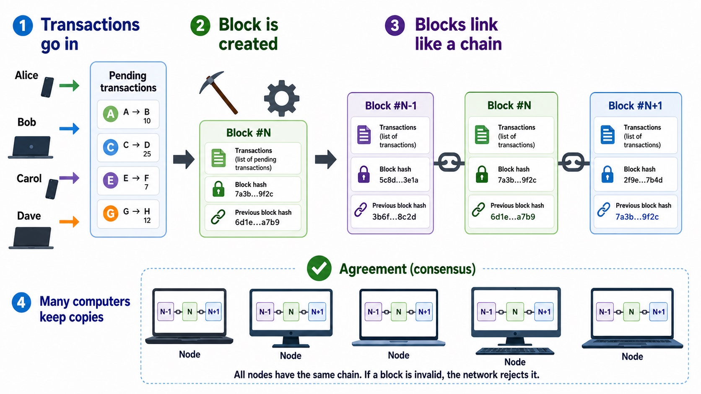

# Blockchain

## What is Blockchain?

A blockchain is a distributed ledger technology that maintains a chain of blocks, where each block contains cryptographically secured data. Each block is linked to the previous block through a hash reference, creating an immutable chain. Any attempt to modify a past block would change its hash, breaking the chain and making the tampering detectable.

Key characteristics:

- **Immutability**: Once data is recorded, it cannot be altered without detection.
- **Transparency**: All transactions are visible to participants.
- **Decentralization**: No single point of control.
- **Security**: Uses cryptographic hashing to secure data.



## Why Use Blockchain?

1. **Data Integrity**: Ensures that records cannot be secretly modified.
2. **Auditability**: Complete history of all transactions is preserved.
3. **Trust**: Eliminates the need for a trusted intermediary.
4. **Security**: Cryptographic hashing makes the data tamper-evident.
5. **Transparency**: All participants have access to the same ledger.

## How to Use It

### Basic Setup

Import the required classes:

```javascript
import Blockchain from './Blockchain';
import BlockchainTransaction from './BlockchainTransaction';
```

### Creating a Blockchain

Create a new blockchain instance with a specified difficulty level, e.g. 3:

```javascript
const blockchain = new Blockchain(3);
```

**Constructor Parameter**:

- `difficulty` (number, default: 2): The number of leading zeros required in a block's hash during mining. Higher number means higher difficulty.

### Adding Transactions

Create transactions and add them to the pending transactions pool:

```javascript
const transaction1 = new BlockchainTransaction({
  from: 'Alice',
  to: 'Bob',
  amount: 50,
  description: 'Payment for services',
});
blockchain.addTransaction(transaction1);

const transaction2 = new BlockchainTransaction({
  from: 'Bob',
  to: 'Charlie',
  amount: 25,
});
blockchain.addTransaction(transaction2);
```

**Transaction Class Properties**:

- `from`: The sender's address
- `to`: The recipient's address
- `amount`: The transaction amount (must be positive)
- `description`: Optional description of the transaction

### Mining Blocks

Mine pending transactions into a new block:

```javascript
const minedBlock = blockchain.minePendingTransactions('Miner1');
```

### Block Structure

Each block contains:

```javascript
index; // Position in blockchain
timestamp; // Creation time in ISO format
data; // Array of transactions in this block
previousHash; // Hash of the previous block
hash; // Current block's hash
nonce; // Number used in proof-of-work calculation
```

### Validating the Blockchain

Verify the integrity of the entire blockchain:

```javascript
if (blockchain.isChainValid()) {
  // Blockchain is valid
} else {
  // Blockchain has been tampered with!
}
```

### Checking Balances

Get the balance of an address by analyzing all transactions:

```javascript
const aliceBalance = blockchain.getBalance('Alice');
console.log(aliceBalance); // 10
```

### Retrieving Transactions

Find all transactions involving a specific address:

```javascript
const aliceTransactions = blockchain.getTransactionsForAddress('Alice');
console.log(aliceTransactions)
// [
//   { block: 1, transaction: {...} },
//   { block: 2, transaction: {...} }
// ]
```

### Getting Latest Block

Access the most recent block in the chain:

```javascript
const latestBlock = blockchain.getLatestBlock();
```

## Complete Example

```javascript
import Blockchain from './Blockchain.js';
import BlockchainTransaction from './BlockchainTransaction.js';

const blockchain = new Blockchain(2);

blockchain.addTransaction(new BlockchainTransaction({
  from: 'Alice',
  to: 'Bob',
  amount: 30,
}));
blockchain.addTransaction(new BlockchainTransaction({
  from: 'Bob',
  to: 'Charlie',
  amount: 15,
}));

blockchain.minePendingTransactions('Miner1');

blockchain.addTransaction(new BlockchainTransaction({
  from: 'Charlie',
  to: 'Alice',
  amount: 10,
}));

blockchain.minePendingTransactions('Miner2');
```

## Implementation Details

### Mining and Difficulty

The `mineBlock(difficulty)` method in BlockchainBlock implements proof-of-work:

- It increments the `nonce` value until the resulting `hash` has the required number of leading zeros.
- Higher difficulty values require exponentially more computational work.
- This mechanism secures the blockchain by making it computationally expensive to tamper with blocks.

### Chain Validation

The `isChainValid()` method ensures:

- Each block's hash matches its calculated hash (prevents tampering).
- Each block's `previousHash` matches the previous block's `hash` (maintains chain integrity).
- The entire chain is unbroken.

### Pending Transactions

Transactions are held in `pendingTransactions` until they are included in a mined block. This allows:

- Multiple transactions to be batched together.
- Efficient block creation.
- Flexibility in mining timing.

## Security Considerations

- **Difficulty**: Increase `difficulty` for higher security (but slower mining).
- **Validation**: Always call `isChainValid()` before trusting the blockchain.
- **Address Verification**: This implementation doesn't include cryptographic signatures. In production, use digital signatures to verify transaction authenticity.
- **Double Spending**: Implement balance checks before accepting transactions in production systems.

## References

This documentation draws from fundamental blockchain concepts and implementation details. Key sources include:

- **Bitcoin Whitepaper**: Nakamoto, S. (2008). "Bitcoin: A Peer-to-Peer Electronic Cash System." Available at: https://bitcoin.org/bitcoin.pdf
- **Mastering Bitcoin**: Antonopoulos, A. M. (2017). "Mastering Bitcoin: Programming the Open Blockchain." O'Reilly Media.
- **Blockchain Technology Overview**: Swan, M. (2015). "Blockchain: Blueprint for a New Economy." O'Reilly Media.
- **Ethereum Documentation**: https://ethereum.org/en/developers/docs/
- **Wikipedia - Blockchain**: https://en.wikipedia.org/wiki/Blockchain
