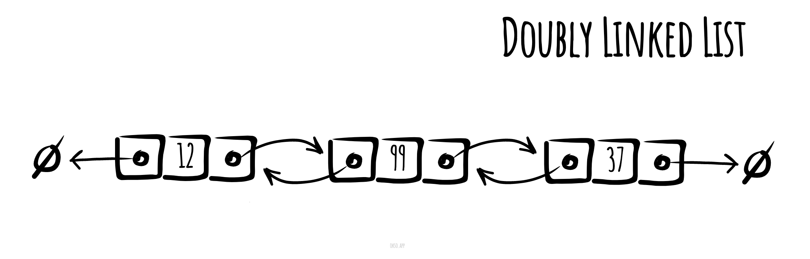

# Двобічно зв'язаний список

**Двобічно зв'язаний список** — зв'язкова структура даних в інформатиці, що складається з набору
послідовно пов'язаних записів, званих вузлами. Кожен вузол містить два поля,
званих посиланнями, які вказують на попередній і наступний елементи
послідовність вузлів. Посилання на попередній елемент кореневого вузла та посилання на
Наступний елемент останнього вузла вказують на деякого роду переривник, зазвичай
сторожовий вузол або null для полегшення обходу списку. Якщо у списку лише один
сторожовий вузол, тоді перелік циклічно пов'язаний через нього.
Двобічно зв'язаний список можна уявити, як два зв'язкові списки, які утворені з
одних і тих самих даних, але розташованих у протилежному порядку.



_Made with [okso.app](https://okso.app)_

Два посилання дозволяють обходити список в обох напрямках. Додавання та
видалення вузла у двозв'язному списку вимагає зміни більшої кількості посилань,
ніж аналогічні операції у зв'язковому списку. Однак дані операції простіше та потенційно
більш ефективні (для некореневих вузлів) – при обході не потрібно стежити за попереднім
вузлом або повторно обходити список у пошуку попереднього вузла, плюс його посилання
може бути змінено.

## Псевдокод основних операцій

### Вставка

```text
Add(value)
  Pre: value - значення, що додається
  Post: value поміщено в кінець списку
  n ← node(value)
  if head = ø
    head ← n
    tail ← n
  else
    n.previous ← tail
    tail.next ← n
    tail ← n
  end if
end Add
```

### Видалення

```text
Remove(head, value)
  Pre: head - перший вузол у списку
       value - значення, яке слід видалити
  Post: true - value видалено зі списку, інакше false
  if head = ø
    return false
  end if
  if value = head.value
    if head = tail
      head ← ø
      tail ← ø
    else
      head ← head.next
      head.previous ← ø
    end if
    return true
  end if
  n ← head.next
  while n = ø and value = n.value
    n ← n.next
  end while
  if n = tail
    tail ← tail.previous
    tail.next ← ø
    return true
  else if n = ø
    n.previous.next ← n.next
    n.next.previous ← n.previous
    return true
  end if
  return false
end Remove
```

### Зворотний обхід

```text
ReverseTraversal(tail)
  Pre: tail - кінцевий елемент обхідного списку
  Post: елементи списку пройдено у зворотному порядку
  n ← tail
  while n = ø
    yield n.value
    n ← n.previous
  end while
end Reverse Traversal
```

## Складність

## Часова складність

| Читання | Пошук | Вставка | Видалення |
| :-----: | :---: | :-----: | :-------: |
|  O(n)   | O(n)  |  O(1)   |   O(n)    |

### Просторова складність

O(n)

## Посилання

- [Wikipedia](https://uk.wikipedia.org/wiki/%D0%94%D0%B2%D0%BE%D0%B1%D1%96%D1%87%D0%BD%D0%BE_%D0%B7%D0%B2%27%D1%8F%D0%B7%D0%B0%D0%BD%D0%B8%D0%B9_%D1%81%D0%BF%D0%B8%D1%81%D0%BE%D0%BA#:~:text=%D0%94%D0%B2%D0%BE%D0%B1%D1%96%D1%87%D0%BD%D0%BE%20%D0%B7%D0%B2'%D1%8F%D0%B7%D0%B0%D0%BD%D0%B8%D0%B9%20%D1%81%D0%BF%D0%B8%D1%81%D0%BE%D0%BA%20%E2%80%94%20%D0%B2%D0%B8%D0%B4,%D0%BD%D0%B0%20%D0%BF%D0%BE%D0%B4%D0%B0%D0%BB%D1%8C%D1%88%D0%B8%D0%B9%20%D0%B2%D1%83%D0%B7%D0%BE%D0%BB%20%D1%83%20%D1%81%D0%BF%D0%B8%D1%81%D0%BA%D1%83.)
