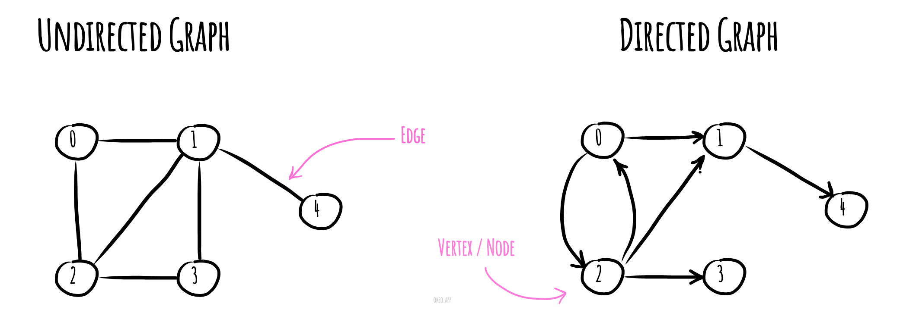

# Граф

**Граф** в інформатиці - абстрактний тип даних, який має реалізовувати концепції спрямованого та неспрямованого
графа у математиці, особливо у галузі теорії графів.

Структура даних графа складається з кінцевого (і можливо, що змінюється) набору вершин або вузлів, або точок, спільно з
набором ненаправлених пар цих вершин для ненаправленого графа або набором спрямованих пар для спрямованого графа.
Ці пари відомі як ребра, арки або лінії для ненаправленого графа та як стрілки, спрямовані ребра, спрямовані
арки чи спрямовані лінії для спрямованого графа. Ці вершини можуть бути частиною структури графа, або зовнішніми
сутностями, представленими цілими індексами або посиланнями.

Для різних областей застосування види графів можуть відрізнятися спрямованістю, обмеженнями на кількість зв'язків та
додатковими даними про вершини або ребра. Багато структур, що становлять практичний інтерес у математиці та
інформатики можуть бути представлені графами. Наприклад, будову Вікіпедії можна змоделювати за допомогою
орієнтованого графа, в якому вершини – це статті, а дуги (орієнтовані ребра) – гіперпосилання.

*Made with [okso.app](https://okso.app)*

## Посилання

- [Граф у математиці на Wikipedia](https://uk.wikipedia.org/wiki/%D0%93%D1%80%D0%B0%D1%84_(%D0%BC%D0%B0%D1%82%D0%B5%D0%BC%D0%B0%D1%82%D0%B8%D0%BA%D0%B0))
- [Структура даних Graph / Граф](https://www.youtube.com/watch?v=D0U8aFEhgKQ)
