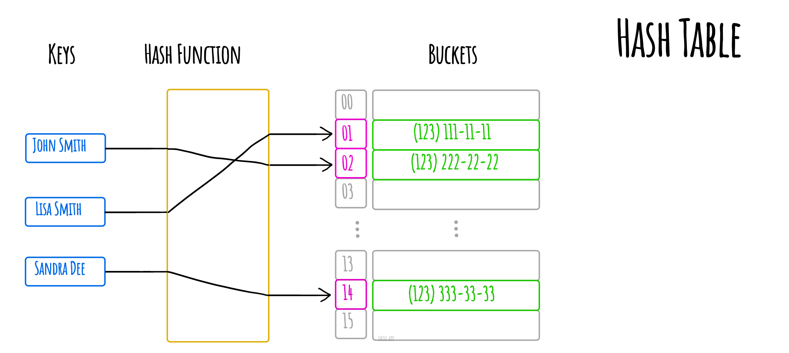
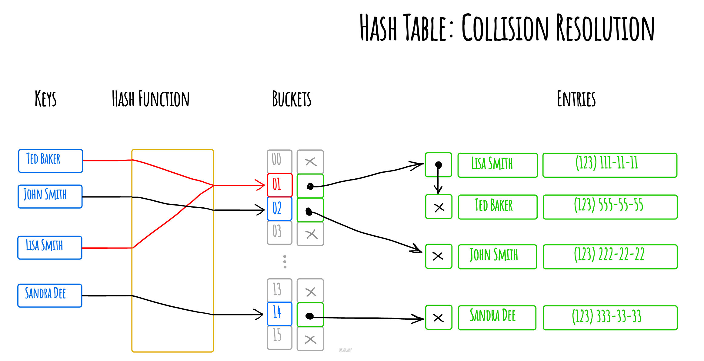

# ハッシュテーブル

コンピュータサイエンスにおいて、**ハッシュテーブル**（ハッシュマップ)は*キーを値にマッピング*できる*連想配列*の機能を持ったデータ構造です。ハッシュテーブルは*ハッシュ関数*を使ってバケットやスロットの配列へのインデックスを計算し、そこから目的の値を見つけることができます。

理想的には、ハッシュ関数は各キーを一意のバケットに割り当てますが、ほとんどのハッシュテーブルは不完全なハッシュ関数を採用しているため、複数のキーに対して同じインデックスを生成した時にハッシュの衝突が起こります。このような衝突は何らかの方法で対処する必要があります。

チェイン法によるハッシュの衝突の解決例

*Made with [okso.app](https://okso.app)*

## 参考

- [Wikipedia](https://en.wikipedia.org/wiki/Hash_table)
- [YouTube](https://www.youtube.com/watch?v=shs0KM3wKv8&index=4&list=PLLXdhg_r2hKA7DPDsunoDZ-Z769jWn4R8)
