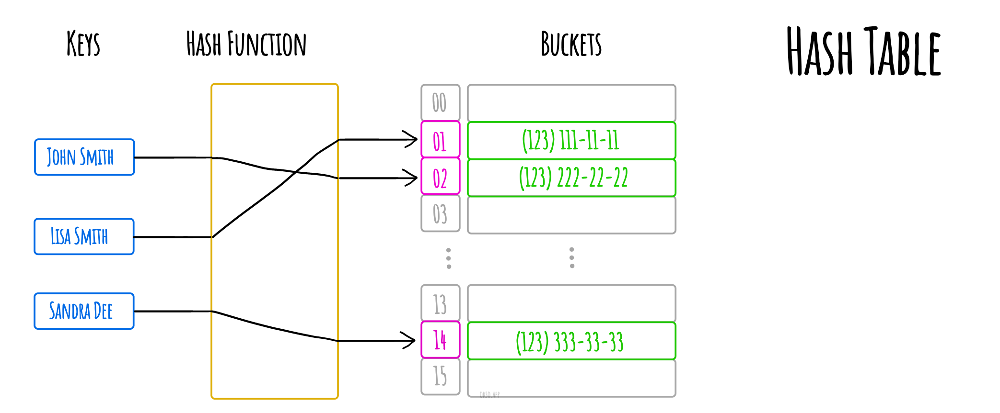

# Hash Table

_Read this in other languages:_
[_简体中文_](README.zh-CN.md),
[_Русский_](README.ru-RU.md),
[_日本語_](README.ja-JP.md),
[_Français_](README.fr-FR.md),
[_Português_](README.pt-BR.md),
[_한국어_](README.ko-KR.md),
[_Українська_](README.uk-UA.md)

In computing, a **hash table** (hash map) is a data
structure which implements an _associative array_
abstract data type, a structure that can _map keys
to values_. A hash table uses a _hash function_ to
compute an index into an array of buckets or slots,
from which the desired value can be found

Ideally, the hash function will assign each key to a
unique bucket, but most hash table designs employ an
imperfect hash function, which might cause hash
collisions where the hash function generates the same
index for more than one key. Such collisions must be
accommodated in some way.

Hash collision resolved by separate chaining.

_Made with [okso.app](https://okso.app)_

## References

- [Wikipedia](https://en.wikipedia.org/wiki/Hash_table)
- [YouTube](https://www.youtube.com/watch?v=shs0KM3wKv8&index=4&list=PLLXdhg_r2hKA7DPDsunoDZ-Z769jWn4R8)
