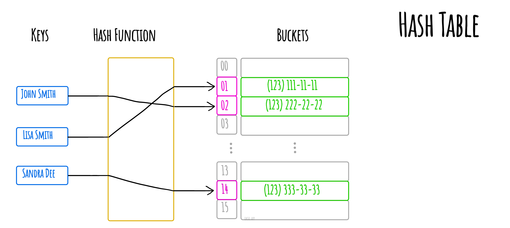
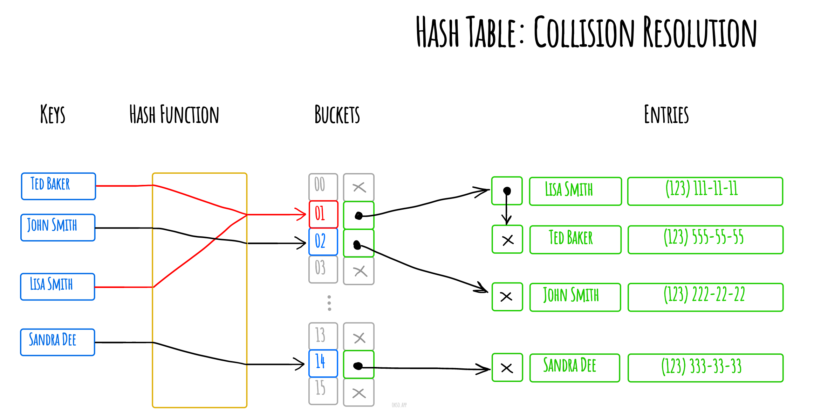

# 雜湊表

_以其他語言閱讀：_
[_English_](README.md),
[_简体中文_](README.zh-CN.md),
[_Русский_](README.ru-RU.md),
[_日本語_](README.ja-JP.md),
[_Français_](README.fr-FR.md),
[_Português_](README.pt-BR.md),
[_한국어_](README.ko-KR.md),
[_Українська_](README.uk-UA.md)

在電腦科學中，**雜湊表**（雜湊對映）是一種實作*關聯式陣列*抽象資料型別的資料結構，它可以將*鍵對映到值*。雜湊表使用*雜湊函數*來計算一個索引值，指向一個桶（bucket）或槽（slot）的陣列，從中可以找到所需的值。

理想情況下，雜湊函數會將每個鍵分配到唯一的桶中，但大多數雜湊表的設計採用不完美的雜湊函數，這可能會導致雜湊碰撞——即雜湊函數為多個不同的鍵產生相同的索引值。這類碰撞必須以某種方式處理。

透過分離鏈結法解決雜湊碰撞

*使用 [okso.app](https://okso.app) 製作*

## 參考資料

- [維基百科](https://zh.wikipedia.org/wiki/哈希表)
- [YouTube](https://www.youtube.com/watch?v=shs0KM3wKv8&index=4&list=PLLXdhg_r2hKA7DPDsunoDZ-Z769jWn4R8)
