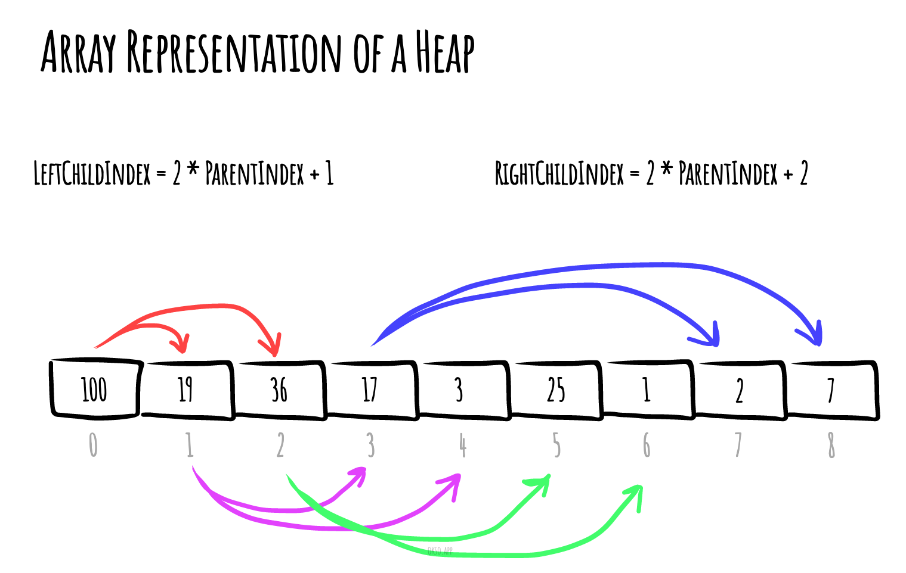

# Heap (data-structure)

_Read this in other languages:_
[_简体中文_](README.zh-CN.md),
[_Русский_](README.ru-RU.md),
[_日本語_](README.ja-JP.md),
[_Français_](README.fr-FR.md),
[_Português_](README.pt-BR.md),
[_Türkçe_](README.tr-TR.md),
[_한국어_](README.ko-KR.md),
[_Українська_](README.uk-UA.md)

In computer science, a **heap** is a specialized tree-based
data structure that satisfies the heap property described
below.

In a *min heap*, if `P` is a parent node of `C`, then the
key (the value) of `P` is less than or equal to the
key of `C`.

*Made with [okso.app](https://okso.app)*

In a *max heap*, the key of `P` is greater than or equal
to the key of `C`

The node at the "top" of the heap with no parents is
called the root node.

## Time Complexities

Here are time complexities of various heap data structures. Function names assume a max-heap.

| Operation | find-max | delete-max | insert| increase-key| meld |
| --------- | -------- | ---------- | ----- | ----------- | ---- |
| [Binary](https://en.wikipedia.org/wiki/Binary_heap) | `Θ(1)` | `Θ(log n)` | `O(log n)` | `O(log n)` | `Θ(n)` |
| [Leftist](https://en.wikipedia.org/wiki/Leftist_tree) | `Θ(1)` | `Θ(log n)` | `Θ(log n)` | `O(log n)` | `Θ(log n)` |
| [Binomial](https://en.wikipedia.org/wiki/Binomial_heap) | `Θ(1)` | `Θ(log n)` | `Θ(1)` | `O(log n)` | `O(log n)` |
| [Fibonacci](https://en.wikipedia.org/wiki/Fibonacci_heap) | `Θ(1)` | `Θ(log n)` | `Θ(1)` | `Θ(1)` | `Θ(1)` |
| [Pairing](https://en.wikipedia.org/wiki/Pairing_heap) | `Θ(1)` | `Θ(log n)` | `Θ(1)` | `o(log n)` | `Θ(1)` |
| [Brodal](https://en.wikipedia.org/wiki/Brodal_queue) | `Θ(1)` | `Θ(log n)` | `Θ(1)` | `Θ(1)` | `Θ(1)` |
| [Rank-pairing](https://en.wikipedia.org/w/index.php?title=Rank-pairing_heap&action=edit&redlink=1) | `Θ(1)` | `Θ(log n)` | `Θ(1)` | `Θ(1)` | `Θ(1)` |
| [Strict Fibonacci](https://en.wikipedia.org/wiki/Fibonacci_heap) | `Θ(1)` | `Θ(log n)` | `Θ(1)` | `Θ(1)` | `Θ(1)` |
| [2-3 heap](https://en.wikipedia.org/wiki/2%E2%80%933_heap) | `O(log n)` | `O(log n)` | `O(log n)` | `Θ(1)` | `?` |

Where:
- **find-max (or find-min):** find a maximum item of a max-heap, or a minimum item of a min-heap, respectively (a.k.a. *peek*)
- **delete-max (or delete-min):** removing the root node of a max heap (or min heap), respectively
- **insert:** adding a new key to the heap (a.k.a., *push*)
- **increase-key or decrease-key:** updating a key within a max- or min-heap, respectively
- **meld:** joining two heaps to form a valid new heap containing all the elements of both, destroying the original heaps.

> In this repository, the [MaxHeap.js](./MaxHeap.js) and [MinHeap.js](./MinHeap.js) are examples of the **Binary** heap.

## References

- [Wikipedia](https://en.wikipedia.org/wiki/Heap_(data_structure))
- [YouTube](https://www.youtube.com/watch?v=t0Cq6tVNRBA&index=5&t=0s&list=PLLXdhg_r2hKA7DPDsunoDZ-Z769jWn4R8)
