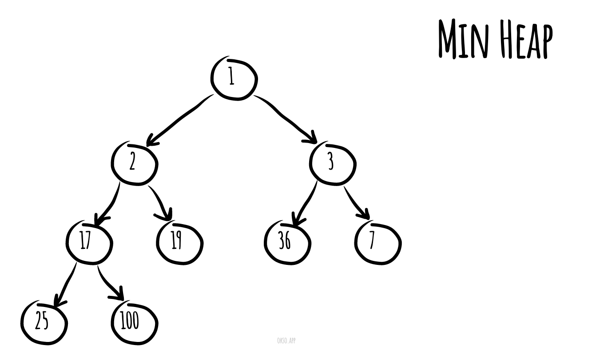
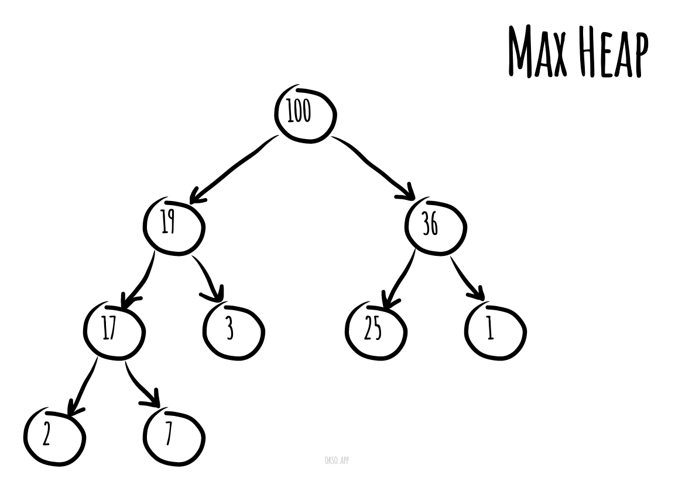
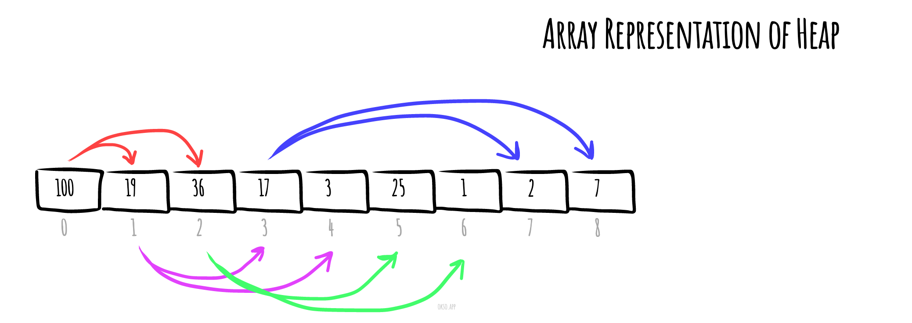

# Heap (data-structure)

Bilgisayar biliminde, **yığın (heap)** aşağıda açıklanan özellikleri karşılayan ağaç tabanlı(tree-based) özel bir veri yapısıdır.

*min heap*, Eğer `P`, `C`'nin üst düğümü ise, `P`'nin anahtarı (değeri)  `C`'nin anahtarından (değerinden) küçük veya ona eşittir.

*Made with [okso.app](https://okso.app)*

*max heap*, `P`'nin anahtarı `C`'nin anahtarından büyük veya eşittir.

Yığının (Heap) "en üstündeki" ebeveyni olmayan düğüme kök düğüm (root node) denir.

## Referanslar

- [Wikipedia](https://en.wikipedia.org/wiki/Heap_(data_structure))
- [YouTube](https://www.youtube.com/watch?v=t0Cq6tVNRBA&index=5&t=0s&list=PLLXdhg_r2hKA7DPDsunoDZ-Z769jWn4R8)
