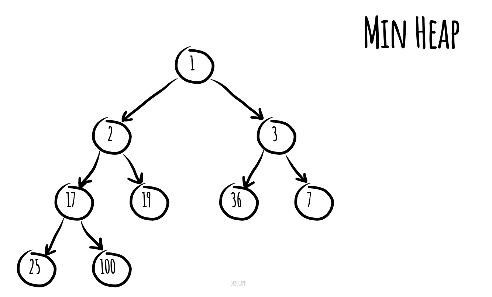
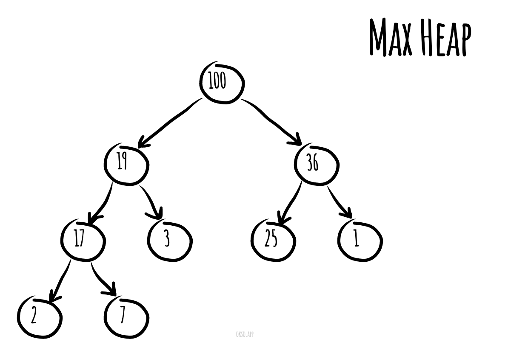
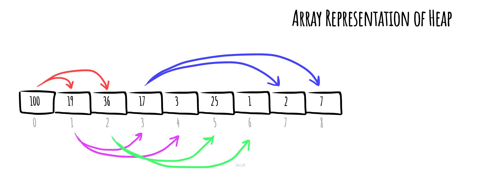

# 堆積（資料結構）

_以其他語言閱讀：_
[_English_](README.md),
[_简体中文_](README.zh-CN.md),
[_Русский_](README.ru-RU.md),
[_日本語_](README.ja-JP.md),
[_Français_](README.fr-FR.md),
[_Português_](README.pt-BR.md),
[_Türkçe_](README.tr-TR.md),
[_한국어_](README.ko-KR.md),
[_Українська_](README.uk-UA.md)

在電腦科學中，**堆積**是一種特殊的樹狀資料結構，滿足以下描述的堆積性質。

在*最小堆積*中，若 `P` 是 `C` 的父節點，則 `P` 的鍵值（數值）小於或等於 `C` 的鍵值。

*使用 [okso.app](https://okso.app) 製作*

在*最大堆積*中，`P` 的鍵值大於或等於 `C` 的鍵值。

堆積中沒有父節點的最頂端節點稱為根節點。

## 時間複雜度

以下是各種堆積資料結構的時間複雜度。函數名稱假設為最大堆積。

| 操作       | find-max   | delete-max | insert     | increase-key | meld       |
| ---------- | ---------- | ---------- | ---------- | ------------ | ---------- |
| [二元堆積](https://en.wikipedia.org/wiki/Binary_heap) | `Θ(1)` | `Θ(log n)` | `O(log n)` | `O(log n)` | `Θ(n)` |
| [左偏樹](https://en.wikipedia.org/wiki/Leftist_tree) | `Θ(1)` | `Θ(log n)` | `Θ(log n)` | `O(log n)` | `Θ(log n)` |
| [二項式堆積](https://en.wikipedia.org/wiki/Binomial_heap) | `Θ(1)` | `Θ(log n)` | `Θ(1)` | `O(log n)` | `O(log n)` |
| [費波那契堆積](https://en.wikipedia.org/wiki/Fibonacci_heap) | `Θ(1)` | `Θ(log n)` | `Θ(1)` | `Θ(1)` | `Θ(1)` |
| [配對堆積](https://en.wikipedia.org/wiki/Pairing_heap) | `Θ(1)` | `Θ(log n)` | `Θ(1)` | `o(log n)` | `Θ(1)` |
| [Brodal 佇列](https://en.wikipedia.org/wiki/Brodal_queue) | `Θ(1)` | `Θ(log n)` | `Θ(1)` | `Θ(1)` | `Θ(1)` |
| [Rank-pairing 堆積](https://en.wikipedia.org/w/index.php?title=Rank-pairing_heap&action=edit&redlink=1) | `Θ(1)` | `Θ(log n)` | `Θ(1)` | `Θ(1)` | `Θ(1)` |
| [嚴格費波那契堆積](https://en.wikipedia.org/wiki/Fibonacci_heap) | `Θ(1)` | `Θ(log n)` | `Θ(1)` | `Θ(1)` | `Θ(1)` |
| [2-3 堆積](https://en.wikipedia.org/wiki/2%E2%80%933_heap) | `O(log n)` | `O(log n)` | `O(log n)` | `Θ(1)` | `?` |

其中：
- **find-max（或 find-min）**：分別找到最大堆積中的最大項目或最小堆積中的最小項目（又稱 *peek*）
- **delete-max（或 delete-min）**：分別移除最大堆積（或最小堆積）的根節點
- **insert**：將新的鍵值加入堆積中（又稱 *push*）
- **increase-key 或 decrease-key**：分別更新最大堆積或最小堆積中的鍵值
- **meld**：將兩個堆積合併成一個新的有效堆積，包含兩者的所有元素，並銷毀原來的堆積

> 在本知識庫中，[MaxHeap.js](./MaxHeap.js) 和 [MinHeap.js](./MinHeap.js) 是**二元堆積**的範例。

## 實作

- [MaxHeap.js](./MaxHeap.js) 和 [MinHeap.js](./MinHeap.js)
- [MaxHeapAdhoc.js](./MaxHeapAdhoc.js) 和 [MinHeapAdhoc.js](./MinHeapAdhoc.js) - MinHeap/MaxHeap 資料結構的極簡（ad hoc）版本，不依賴外部相依套件，可在面試中輕鬆複製貼上使用（因為 JavaScript 中缺少許多資料結構）。

## 參考資料

- [維基百科](https://zh.wikipedia.org/wiki/堆_(資料結構))
- [YouTube](https://www.youtube.com/watch?v=t0Cq6tVNRBA&index=5&t=0s&list=PLLXdhg_r2hKA7DPDsunoDZ-Z769jWn4R8)
