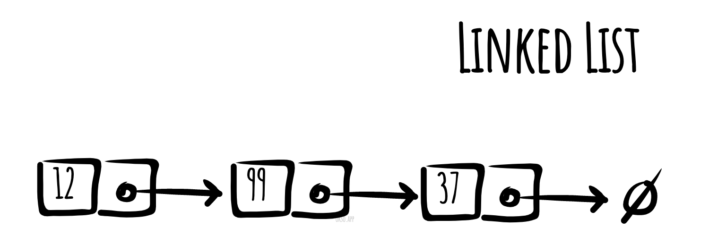

# Зв'язаний список

Зв'язаний список — базова динамічна структура даних в інформатиці, що складається з вузлів, кожен з яких містить як дані, так посилання («зв'язку») на наступний вузол списку. Дана структура дозволяє ефективно додавати та видаляти елементи на довільній позиції у послідовності у процесі ітерації. Більш складні варіанти включають додаткові посилання, що дозволяють ефективно додавати та видаляти довільні елементи.

Принциповою перевагою перед масивом є структурна гнучкість: порядок елементів зв'язкового списку може збігатися з порядком розташування елементів даних у пам'яті комп'ютера, а порядок обходу списку завжди явно задається його внутрішніми зв'язками. Суть переваги у тому, що у багатьох мовах створення масиву вимагає вказати його заздалегідь. Зв'язковий список дозволяє обійти це обмеження.

Недоліком зв'язкових списків є те, що час доступу є лінійним (і важко для реалізації конвеєрів). Неможливий швидкий доступ (випадковий).



*Made with [okso.app](https://okso.app)*

## Псевдокод основних операцій

### Вставка

```text
Add(value)
  Pre: value - значення, що додається
  Post: value поміщено в кінець списку
  n ← node(value)
  if head = ø
    head ← n
    tail ← n
  else
    tail.next ← n
    tail ← n
  end if
end Add
```

```text
Prepend(value)
 Pre: value - значення, що додається
 Post: value поміщено на початок списку
 n ← node(value)
 n.next ← head
 head ← n
 if tail = ø
   tail ← n
 end
end Prepend
```

### Поиск

```text
Contains(head, value)
  Pre: head - перший вузол у списку
         value - значення, яке слід знайти
  Post: true - value знайдено у списку, інакше false
  n ← head
  while n != ø and n.value != value
    n ← n.next
  end while
  if n = ø
    return false
  end if
  return true
end Contains
```

### Вилучення

```text
Remove(head, value)
  Pre: head - перший вузол у списку
       value - значення, яке слід видалити
  Post: true - value видалено зі списку, інакше false
  if head = ø
    return false
  end if
  n ← head
  if n.value = value
    if head = tail
      head ← ø
      tail ← ø
    else
      head ← head.next
    end if
    return true
  end if
  while n.next != ø and n.next.value != value
    n ← n.next
  end while
  if n.next != ø
    if n.next = tail
      tail ← n
    end if
    n.next ← n.next.next
    return true
  end if
  return false
end Remove
```

### Обход

```text
Traverse(head)
  Pre: head - перший вузол у списку
  Post: елементи списку пройдені
  n ← head
  while n != ø
    yield n.value
    n ← n.next
  end while
end Traverse
```

### Зворотний обхід

```text
ReverseTraversal(head, tail)
  Pre: head и tail відносяться до одного списку
  Post: елементи списку пройдено у зворотному порядку
  if tail != ø
    curr ← tail
    while curr != head
      prev ← head
      while prev.next != curr
        prev ← prev.next
      end while
      yield curr.value
      curr ← prev
    end while
   yield curr.value
  end if
end ReverseTraversal
```

## Складність

### Тимчасова складність

| Читання    | Пошук     | Вставка    | Вилучення |
| :--------: | :-------: | :--------: | :-------: |
| O(n)       | O(n)      | O(1)       | O(n)      |

### Просторова складність

O(n)

## Посилання

- [Wikipedia](https://uk.wikipedia.org/wiki/%D0%97%D0%B2%27%D1%8F%D0%B7%D0%B0%D0%BD%D0%B8%D0%B9_%D1%81%D0%BF%D0%B8%D1%81%D0%BE%D0%BA)
- [YouTube](https://www.youtube.com/watch?v=6snsMa4E1Os)
