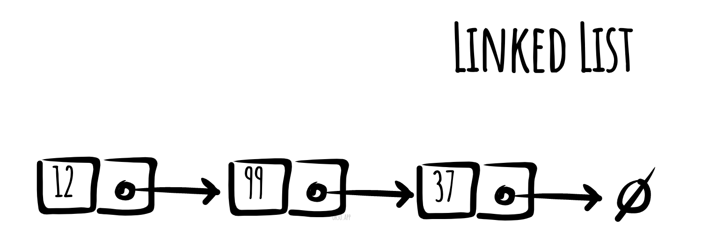

# 鏈結串列

_以其他語言閱讀：_
[_English_](README.md),
[_简体中文_](README.zh-CN.md),
[_Русский_](README.ru-RU.md),
[_日本語_](README.ja-JP.md),
[_Português_](README.pt-BR.md),
[_한국어_](README.ko-KR.md),
[_Español_](README.es-ES.md),
[_Türkçe_](README.tr-TR.md),
[_Українська_](README.uk-UA.md)

在電腦科學中，**鏈結串列**是一種資料元素的線性集合，其線性順序不是由元素在記憶體中的物理位置決定的。每個元素指向下一個元素。鏈結串列是由一組節點組成的資料結構，這些節點共同表示一個序列。在最簡單的形式下，每個節點由資料和一個指向序列中下一個節點的參考（換句話說，就是一個連結）組成。這種結構允許在走訪過程中，從序列的任何位置有效率地插入或移除元素。更複雜的變體會增加額外的連結，允許從任意元素參考進行有效率的插入或移除。鏈結串列的缺點是存取時間為線性的（且難以進行管線化處理）。較快速的存取方式，如隨機存取，是不可行的。與鏈結串列相比，陣列擁有更好的快取局部性。



*使用 [okso.app](https://okso.app) 製作*

## 基本操作的虛擬碼

### 插入

```text
Add(value)
  Pre: value 是要新增到串列的值
  Post: value 已被放置在串列的尾端
  n ← node(value)
  if head = ø
    head ← n
    tail ← n
  else
    tail.next ← n
    tail ← n
  end if
end Add
```

```text
Prepend(value)
 Pre: value 是要新增到串列的值
 Post: value 已被放置在串列的頭部
 n ← node(value)
 n.next ← head
 head ← n
 if tail = ø
   tail ← n
 end
end Prepend
```

### 搜尋

```text
Contains(head, value)
  Pre: head 是串列中的頭部節點
       value 是要搜尋的值
  Post: 如果項目在鏈結串列中則回傳 true；否則回傳 false
  n ← head
  while n != ø and n.value != value
    n ← n.next
  end while
  if n = ø
    return false
  end if
  return true
end Contains
```

### 刪除

```text
Remove(head, value)
  Pre: head 是串列中的頭部節點
       value 是要從串列中移除的值
  Post: 如果 value 從串列中移除則回傳 true，否則回傳 false
  if head = ø
    return false
  end if
  n ← head
  if n.value = value
    if head = tail
      head ← ø
      tail ← ø
    else
      head ← head.next
    end if
    return true
  end if
  while n.next != ø and n.next.value != value
    n ← n.next
  end while
  if n.next != ø
    if n.next = tail
      tail ← n
      tail.next = null
    else
      n.next ← n.next.next
    end if
    return true
  end if
  return false
end Remove
```

### 走訪

```text
Traverse(head)
  Pre: head 是串列中的頭部節點
  Post: 串列中的項目已被走訪
  n ← head
  while n != ø
    yield n.value
    n ← n.next
  end while
end Traverse
```

### 反向走訪

```text
ReverseTraversal(head, tail)
  Pre: head 和 tail 屬於同一個串列
  Post: 串列中的項目已被反向走訪
  if tail != ø
    curr ← tail
    while curr != head
      prev ← head
      while prev.next != curr
        prev ← prev.next
      end while
      yield curr.value
      curr ← prev
    end while
   yield curr.value
  end if
end ReverseTraversal
```

## 複雜度

### 時間複雜度

| 存取      | 搜尋      | 插入      | 刪除      |
| :-------: | :-------: | :-------: | :-------: |
| O(n)      | O(n)      | O(1)      | O(n)      |

### 空間複雜度

O(n)

## 參考資料

- [維基百科](https://zh.wikipedia.org/wiki/链表)
- [YouTube](https://www.youtube.com/watch?v=njTh_OwMljA&index=2&t=1s&list=PLLXdhg_r2hKA7DPDsunoDZ-Z769jWn4R8)
