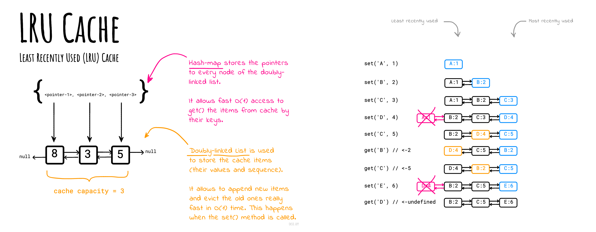

# Least Recently Used (LRU) Cache

_Read this in other languages:_
[한국어](README.ko-KR.md),

A **Least Recently Used (LRU) Cache** organizes items in order of use, allowing you to quickly identify which item hasn't been used for the longest amount of time.

Picture a clothes rack, where clothes are always hung up on one side. To find the least-recently used item, look at the item on the other end of the rack.

## The problem statement

Implement the LRUCache class:

- `LRUCache(int capacity)` Initialize the LRU cache with **positive** size `capacity`.
- `int get(int key)` Return the value of the `key` if the `key` exists, otherwise return `undefined`.
- `void set(int key, int value)` Update the value of the `key` if the `key` exists. Otherwise, add the `key-value` pair to the cache. If the number of keys exceeds the `capacity` from this operation, **evict** the least recently used key.

The functions `get()` and `set()` must each run in `O(1)` average time complexity.

## Implementation

### Version 1: Doubly Linked List + Hash Map

See the `LRUCache` implementation example in [LRUCache.js](./LRUCache.js). The solution uses a `HashMap` for fast `O(1)` (in average) cache items access, and a `DoublyLinkedList` for fast `O(1)` (in average) cache items promotions and eviction (to keep the maximum allowed cache capacity).

_Made with [okso.app](https://okso.app)_

You may also find more test-case examples of how the LRU Cache works in [LRUCache.test.js](./__test__/LRUCache.test.js) file.

### Version 2: Ordered Map

The first implementation that uses doubly linked list is good for learning purposes and for better understanding of how the average `O(1)` time complexity is achievable while doing `set()` and `get()`.

However, the simpler approach might be to use a JavaScript [Map](https://developer.mozilla.org/en-US/docs/Web/JavaScript/Reference/Global_Objects/Map) object. The `Map` object holds key-value pairs and **remembers the original insertion order** of the keys. We can use this fact in order to keep the recently-used items in the "end" of the map by removing and re-adding items. The item at the beginning of the `Map` is the first one to be evicted if cache capacity overflows. The order of the items may checked by using the `IterableIterator` like `map.keys()`.

See the `LRUCacheOnMap` implementation example in [LRUCacheOnMap.js](./LRUCacheOnMap.js).

You may also find more test-case examples of how the LRU Cache works in [LRUCacheOnMap.test.js](./__test__/LRUCacheOnMap.test.js) file.

## Complexities

|          | Average |
| -------- | ------- |
| Space    | `O(n)`  |
| Get item | `O(1)`  |
| Set item | `O(1)`  |

## References

- [LRU Cache on LeetCode](https://leetcode.com/problems/lru-cache/solutions/244744/lru-cache/)
- [LRU Cache on InterviewCake](https://www.interviewcake.com/concept/java/lru-cache)
- [LRU Cache on Wiki](https://en.wikipedia.org/wiki/Cache_replacement_policies)
