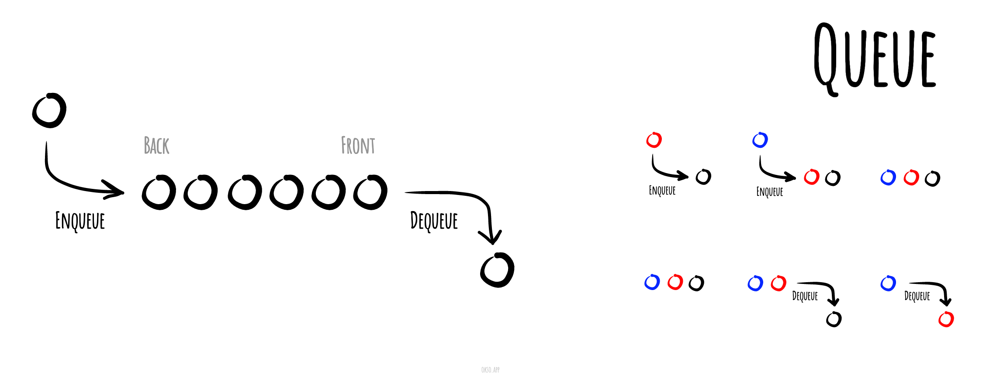

# Черга

Черга (англ. queue) – структура даних в інформатиці, в якій елементи
зберігаються у порядку їх додавання. Додавання нових елементів(enqueue)
здійснюється на кінець списку. А видалення елементів (dequeue)
здійснюється із початку. Таким чином черга реалізує принцип
"першим увійшов – першим вийшов" (FIFO). Часто реалізується операція читання
головного елемента (peek), яка повертає перший у черзі елемент,
при цьому не видаляючи його. Черга є прикладом лінійної структури
даних чи послідовної колекції.

Ілюстрація роботи з чергою.

*Made with [okso.app](https://okso.app)*

## Список літератури

- [Wikipedia](https://uk.wikipedia.org/wiki/%D0%A7%D0%B5%D1%80%D0%B3%D0%B0_(%D1%81%D1%82%D1%80%D1%83%D0%BA%D1%82%D1%83%D1%80%D0%B0_%D0%B4%D0%B0%D0%BD%D0%B8%D1%85))
- [YouTube](https://www.youtube.com/watch?v=ll4QLNSPn60)
