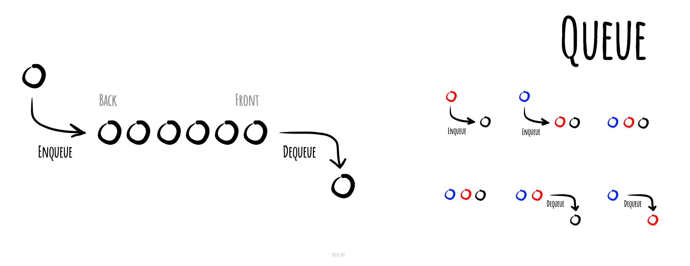

# 佇列

_以其他語言閱讀：_
[_English_](README.md),
[_简体中文_](README.zh-CN.md),
[_Русский_](README.ru-RU.md),
[_日本語_](README.ja-JP.md),
[_Français_](README.fr-FR.md),
[_Português_](README.pt-BR.md),
[_한국어_](README.ko-KR.md),
[_Українська_](README.uk-UA.md)

在電腦科學中，**佇列**是一種特定的抽象資料型別或集合，其中集合中的元素按照順序排列，對集合的主要（或唯一）操作是將元素加入到尾端位置（稱為 enqueue，入列），以及從前端位置移除元素（稱為 dequeue，出列）。這使得佇列成為先進先出（FIFO, First-In-First-Out）的資料結構。在 FIFO 資料結構中，第一個被加入佇列的元素將會是第一個被移除的。這等同於一旦新元素被加入後，所有在其之前加入的元素都必須先被移除，新元素才能被移除。通常還會提供一個 peek 或 front 操作，用於回傳前端元素的值而不將其移出佇列。佇列是線性資料結構的一個範例，或更抽象地說，是一種循序集合。

先進先出（FIFO）佇列的示意圖

*使用 [okso.app](https://okso.app) 製作*

## 參考資料

- [維基百科](https://zh.wikipedia.org/wiki/队列)
- [YouTube](https://www.youtube.com/watch?v=wjI1WNcIntg&list=PLLXdhg_r2hKA7DPDsunoDZ-Z769jWn4R8&index=3&)
