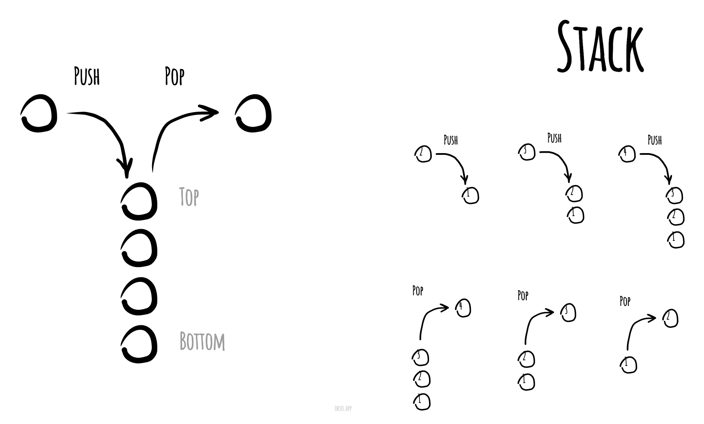

# Стек

Стек (англ. stack - стопка) - абстрактний тип даних, що представляє собою
список елементів, організованих за принципом LIFO (останнім прийшов – першим вийшов).

Стек має дві ключові операції:
* **додавання (push)** елемента в кінець стеку, та
* **видалення (pop)**, останнього доданого елемента.

Додаткова операція для читання головного елемента (peek) дає доступ
до останнього елементу стека без зміни самого стека.

Найчастіше принцип роботи стека порівнюють зі чаркою тарілок: щоб узяти другу
зверху потрібно зняти верхню.

Ілюстрація роботи зі стеком.

*Made with [okso.app](https://okso.app)*

## Посилання

- [Wikipedia](https://uk.wikipedia.org/wiki/%D0%A1%D1%82%D0%B5%D0%BA)
- [YouTube](https://www.youtube.com/watch?v=4jh1e1YCbYc)
