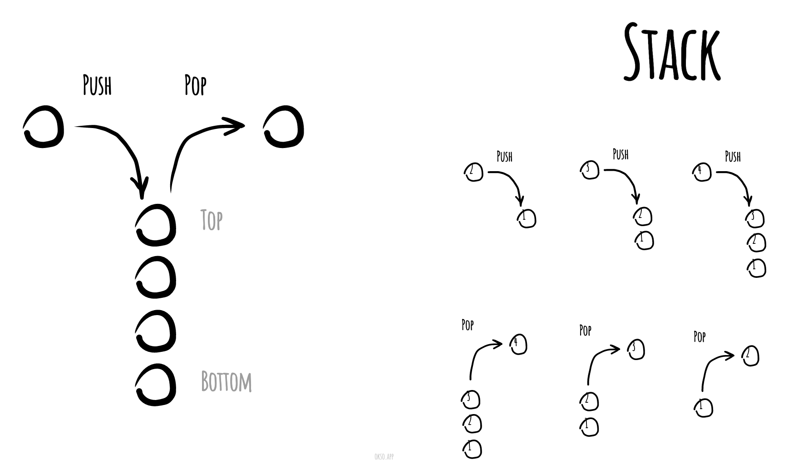

# 堆疊

_以其他語言閱讀：_
[_English_](README.md),
[_简体中文_](README.zh-CN.md),
[_Русский_](README.ru-RU.md),
[_日本語_](README.ja-JP.md),
[_Français_](README.fr-FR.md),
[_Português_](README.pt-BR.md),
[_한국어_](README.ko-KR.md),
[_Українська_](README.uk-UA.md)

在電腦科學中，**堆疊**是一種作為元素集合的抽象資料型別，具有兩個主要操作：

* **push**：將元素加入集合
* **pop**：移除最近加入且尚未被移除的元素

元素離開堆疊的順序產生了它的另一個名稱——LIFO（Last In, First Out，後進先出）。此外，peek 操作可以存取堆疊頂端的元素而不修改堆疊。「堆疊」這個名稱來自於一疊物品堆放在一起的比喻——從堆疊頂端取出物品很容易，但要取得堆疊深處的物品可能需要先移開許多其他物品。

堆疊執行時期的 push 和 pop 操作簡單示意圖

*使用 [okso.app](https://okso.app) 製作*

## 參考資料

- [維基百科](https://zh.wikipedia.org/wiki/堆栈)
- [YouTube](https://www.youtube.com/watch?v=wjI1WNcIntg&list=PLLXdhg_r2hKA7DPDsunoDZ-Z769jWn4R8&index=3&)
