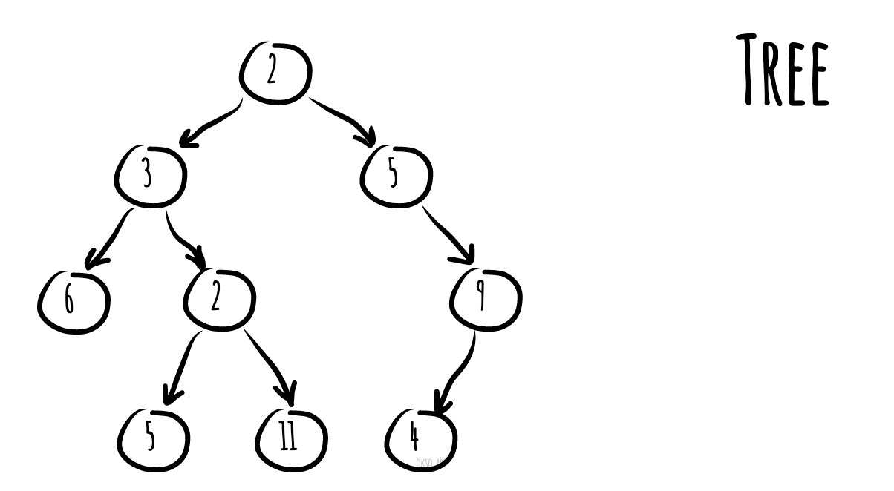

# 樹

_以其他語言閱讀：_
[_English_](README.md),
[_简体中文_](README.zh-CN.md),
[_Português_](README.pt-BR.md)

* [二元搜尋樹](binary-search-tree)
* [AVL 樹](avl-tree)
* [紅黑樹](red-black-tree)
* [線段樹](segment-tree) - 包含最小值/最大值/總和的範圍查詢範例
* [樹狀數組](fenwick-tree)（二元索引樹）

在電腦科學中，**樹**是一種廣泛使用的抽象資料型別（ADT）——或實作此 ADT 的資料結構——它模擬一種階層式的樹狀結構，具有一個根值以及由父節點表示的子樹，呈現為一組鏈結的節點。

樹狀資料結構可以被遞迴地（局部地）定義為節點的集合（從根節點開始），其中每個節點是一個由值和指向其他節點的參考列表（稱為「子節點」）組成的資料結構，並且不允許重複的參考，也沒有參考指向根節點。

一棵簡單的無序樹；在此圖中，標記為 3 的節點有兩個子節點（標記為 2 和 6），以及一個父節點（標記為 2）。最頂端的根節點沒有父節點。

*使用 [okso.app](https://okso.app) 製作*

## 參考資料

- [維基百科](https://zh.wikipedia.org/wiki/树_(数据结构))
- [YouTube](https://www.youtube.com/watch?v=oSWTXtMglKE&list=PLLXdhg_r2hKA7DPDsunoDZ-Z769jWn4R8&index=8)
