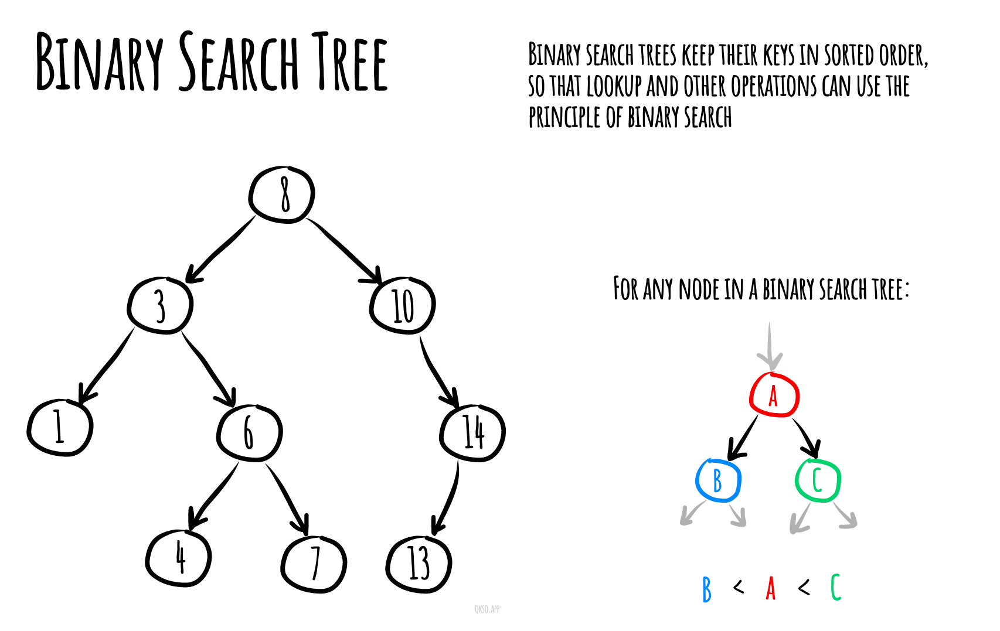

# 二叉搜索树

_Read this in other languages:_
[_Português_](README.pt-BR.md),[_English_](README.md)

在计算机科学中, **二叉搜索树** (BST), 也称为有序二叉树或排序二叉树, 是一种特殊的容器:
在内存中存储“元素”的数据结构（如数字，名称等）。二叉搜索树可以快速查找，添加和删除元素，也可用于
构建动态元素集或在表中根据键查找元素值 （例：通过某人姓名找到某人的手机号）。

二叉搜索树为有序序列，所以在进行查找或其他操作时可以使用二分查找原理：
在树中寻找键（或插入新键的位置）时，查找过程为: 从根到叶遍历树，通过比较
存储在树的节点中的键来判断继续向左或向右搜索子树。 平均而言，这意味着每次
比较都允许跳过大约一半的操作，这样每个查找、插入或删除所花费的时间为
树中存储的项目数的对数。 这是比按键在（未排序的）数组中查找元素所需的
线性时间要好得多，但比在哈希表中相应的操作慢。

下图为一个大小为 9，深度为 3，8 为根结点的二叉搜索树。
叶子节点没有被绘制。



_Made with [okso.app](https://okso.app)_

## 基础操作的伪代码

### 插入

```text
insert(value)
  Pre: value has passed custom type checks for type T
  Post: value has been placed in the correct location in the tree
  if root = ø
    root ← node(value)
  else
    insertNode(root, value)
  end if
end insert
```

```text
insertNode(current, value)
  Pre: current is the node to start from
  Post: value has been placed in the correct location in the tree
  if value < current.value
    if current.left = ø
      current.left ← node(value)
    else
      InsertNode(current.left, value)
    end if
  else
    if current.right = ø
      current.right ← node(value)
    else
      InsertNode(current.right, value)
    end if
  end if
end insertNode
```

### 查找

```text
contains(root, value)
  Pre: root is the root node of the tree, value is what we would like to locate
  Post: value is either located or not
  if root = ø
    return false
  end if
  if root.value = value
    return true
  else if value < root.value
    return contains(root.left, value)
  else
    return contains(root.right, value)
  end if
end contains
```

### 删除

```text
remove(value)
  Pre: value is the value of the node to remove, root is the node of the BST
      count is the number of items in the BST
  Post: node with value is removed if found in which case yields true, otherwise false
  nodeToRemove ← findNode(value)
  if nodeToRemove = ø
    return false
  end if
  parent ← findParent(value)
  if count = 1
    root ← ø
  else if nodeToRemove.left = ø and nodeToRemove.right = ø
    if nodeToRemove.value < parent.value
      parent.left ←  nodeToRemove.right
    else
      parent.right ← nodeToRemove.right
    end if
  else if nodeToRemove.left != ø and nodeToRemove.right != ø
    next ← nodeToRemove.right
    while next.left != ø
      next ← next.left
    end while
    if next != nodeToRemove.right
      remove(next.value)
      nodeToRemove.value ← next.value
    else
      nodeToRemove.value ← next.value
      nodeToRemove.right ← nodeToRemove.right.right
    end if
  else
    if nodeToRemove.left = ø
      next ← nodeToRemove.right
    else
      next ← nodeToRemove.left
    end if
    if root = nodeToRemove
      root = next
    else if parent.left = nodeToRemove
      parent.left = next
    else if parent.right = nodeToRemove
      parent.right = next
    end if
  end if
  count ← count - 1
  return true
end remove
```

### 查找某个节点的父节点

```text
findParent(value, root)
  Pre: value is the value of the node we want to find the parent of
       root is the root node of the BST and is != ø
  Post: a reference to the prent node of value if found; otherwise ø
  if value = root.value
    return ø
  end if
  if value < root.value
    if root.left = ø
      return ø
    else if root.left.value = value
      return root
    else
      return findParent(value, root.left)
    end if
  else
    if root.right = ø
      return ø
    else if root.right.value = value
      return root
    else
      return findParent(value, root.right)
    end if
  end if
end findParent
```

### 查找节点

```text
findNode(root, value)
  Pre: value is the value of the node we want to find the parent of
       root is the root node of the BST
  Post: a reference to the node of value if found; otherwise ø
  if root = ø
    return ø
  end if
  if root.value = value
    return root
  else if value < root.value
    return findNode(root.left, value)
  else
    return findNode(root.right, value)
  end if
end findNode
```

### 查找最小值

```text
findMin(root)
  Pre: root is the root node of the BST
    root = ø
  Post: the smallest value in the BST is located
  if root.left = ø
    return root.value
  end if
  findMin(root.left)
end findMin
```

### 查找最大值

```text
findMax(root)
  Pre: root is the root node of the BST
    root = ø
  Post: the largest value in the BST is located
  if root.right = ø
    return root.value
  end if
  findMax(root.right)
end findMax
```

### 遍历

#### 中序遍历

```text
inorder(root)
  Pre: root is the root node of the BST
  Post: the nodes in the BST have been visited in inorder
  if root != ø
    inorder(root.left)
    yield root.value
    inorder(root.right)
  end if
end inorder
```

#### 前序遍历

```text
preorder(root)
  Pre: root is the root node of the BST
  Post: the nodes in the BST have been visited in preorder
  if root != ø
    yield root.value
    preorder(root.left)
    preorder(root.right)
  end if
end preorder
```

#### 后序遍历

```text
postorder(root)
  Pre: root is the root node of the BST
  Post: the nodes in the BST have been visited in postorder
  if root != ø
    postorder(root.left)
    postorder(root.right)
    yield root.value
  end if
end postorder
```

## 复杂度

### 时间复杂度

|  Access   |  Search   | Insertion | Deletion  |
| :-------: | :-------: | :-------: | :-------: |
| O(log(n)) | O(log(n)) | O(log(n)) | O(log(n)) |

### 空间复杂度

O(n)

## 参考资料

- [Wikipedia](https://en.wikipedia.org/wiki/Binary_search_tree)
- [Inserting to BST on YouTube](https://www.youtube.com/watch?v=wcIRPqTR3Kc&list=PLLXdhg_r2hKA7DPDsunoDZ-Z769jWn4R8&index=9&t=0s)
- [BST Interactive Visualisations](https://www.cs.usfca.edu/~galles/visualization/BST.html)
