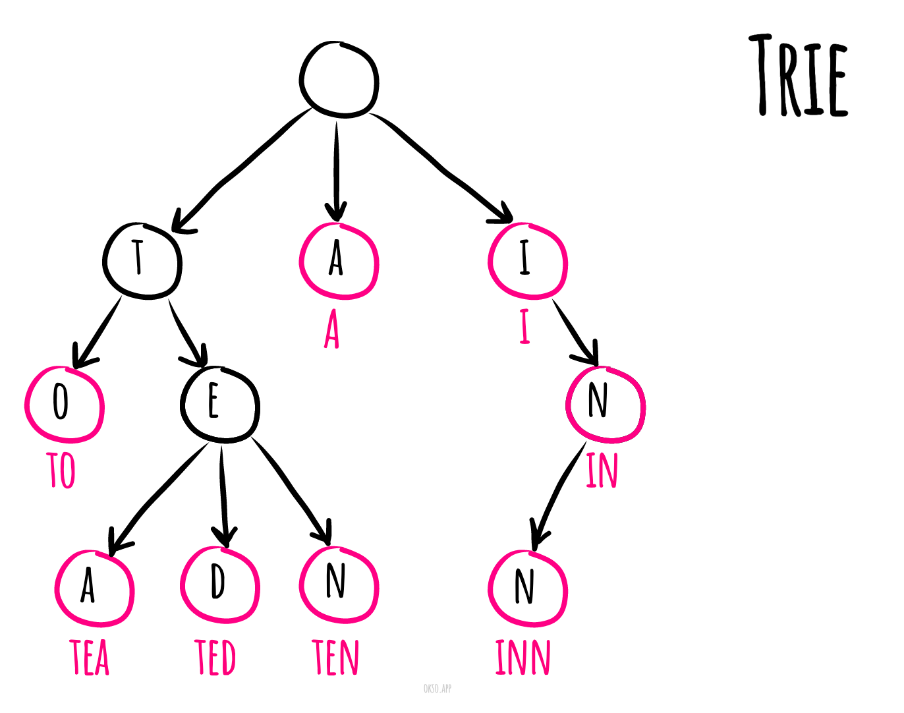

# Префіксне дерево

**Префіксне дерево** (Також промінь, навантажене або суфіксне дерево) в інформатиці - впорядкована деревоподібна
структура даних, яка використовується для зберігання динамічних множин або асоціативних масивів, де
ключем зазвичай виступають рядки. Дерево називається префіксним, тому що пошук здійснюється за префіксами.

На відміну від бінарного дерева, вузли не містять ключів, що відповідають вузлу. Являє собою кореневе дерево, кожне
ребро якого позначено якимось символом так, що для будь-якого вузла всі ребра, що з'єднують цей вузол з його синами,
позначені різними символами. Деякі вузли префіксного дерева виділені (на малюнку вони підписані цифрами) і вважається,
що префіксне дерево містить цей рядок-ключ тоді і тільки тоді, коли цей рядок можна прочитати на шляху з
кореня до певного виділеного вузла.

Таким чином, на відміну від бінарних дерев пошуку, ключ, що ідентифікує конкретний вузол дерева, не явно зберігається в
цьому вузлі, а неявно задається положенням цього вузла в дереві. Отримати ключ можна виписуванням поспіль символів,
помічають ребра по дорозі від кореня до вузла. Ключ кореня дерева - порожній рядок. Часто у виділених вузлах зберігають
додаткову інформацію, пов'язану з ключем, і зазвичай виділеними є тільки листя і, можливо, деякі
внутрішні вузли.

*Made with [okso.app](https://okso.app)*

На малюнку представлено префіксне дерево, що містить ключі. «A», «to», «tea», «ted», «ten», «i», «in», «inn».

## Посилання

- [Wikipedia](https://uk.wikipedia.org/wiki/%D0%9F%D1%80%D0%B5%D1%84%D1%96%D0%BA%D1%81%D0%BD%D0%B5_%D0%B4%D0%B5%D1%80%D0%B5%D0%B2%D0%BE)
